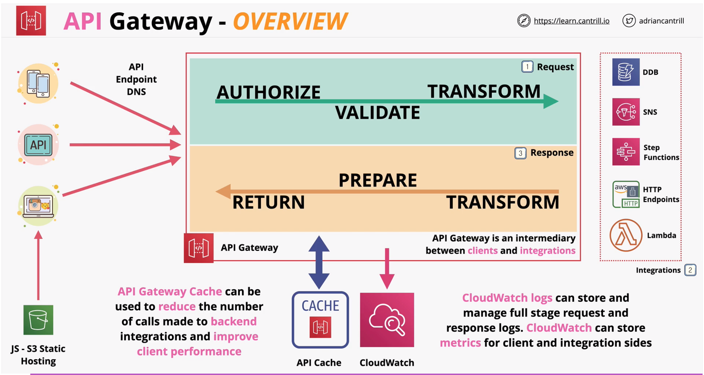
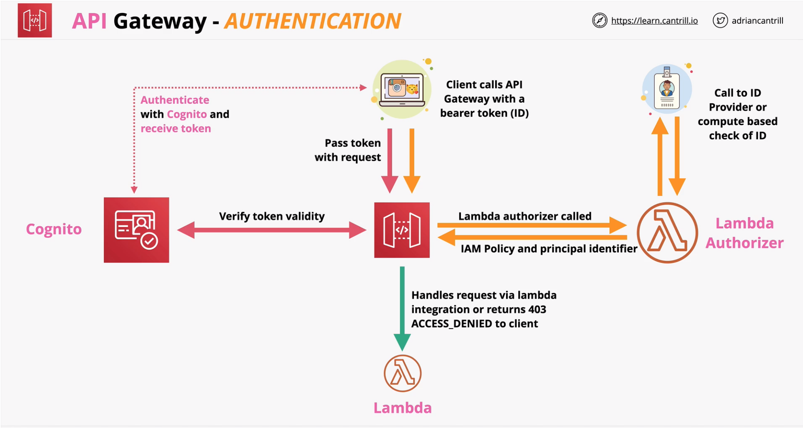
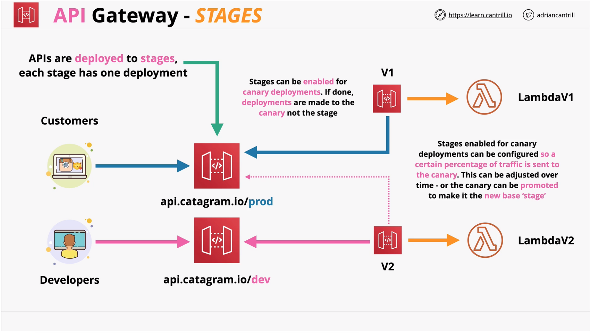
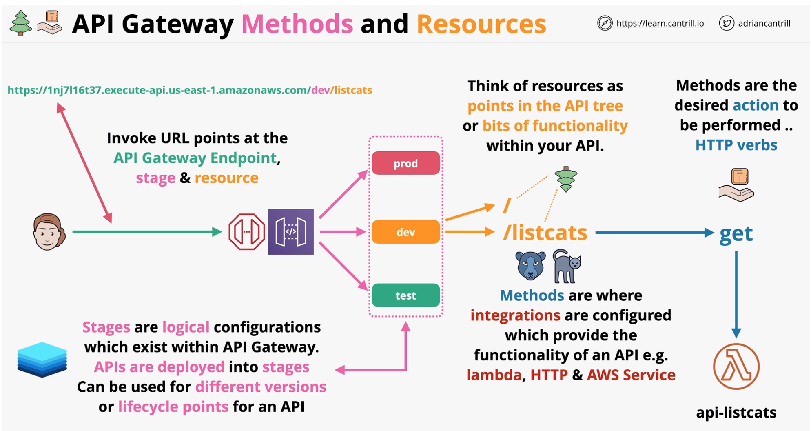
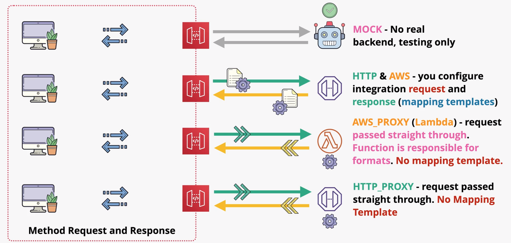
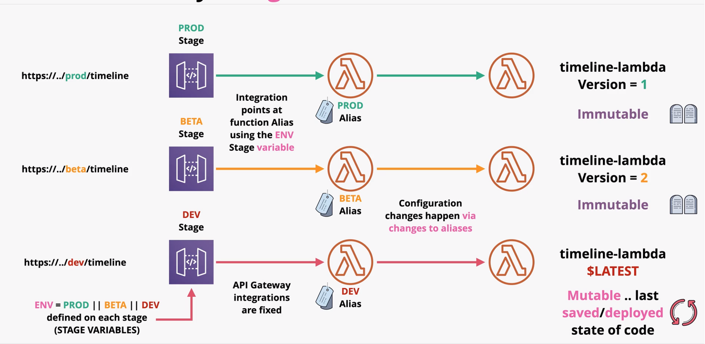

### API Gateway
- create and manage APIs
- highly available and scalable
- handles authorization, throttling, caching, CORS, transformations, OpenAPI spec
- direct integrations with AWS services (dynamo, step-functions, SNS)
- public services - both on-premise and AWS
- HTTP APIs, REST APIs and Websocket APIs

#### Overview

#### Authentication

#### Endpoint Types
- **Edge Optimized**
    - routed to the nearest cloudfront POP (point of presence)
- **Regional**
    - clients in the same region
- **Private**
    - endpoint accessible only withing a VPC via interface endpoint

#### Stages

#### Error Codes
- 4XX - Client Error - Invalid request on client side
- 5XX - Server Error - Valid request, backend issue
- API Gateway Timeout Limit - 29s

| HTTP Status Code | Error code | Retry |
| ---: | ---- | --- 
400 |	Bad Request Exception (generic) |	No |
403	| Access Denied Exception	| No |
404	| Not Found Exception	| No |
409	| Conflict Exception	| No |
429	| Limit Exceeded Exception	| No |
429	| Too Many Requests Exception	| Yes |
502	| Bad Gateway Exception, usually for an incompatible output returned from a Lambda proxy integration backend and occasionally for out-of-order invocations due to heavy loads.	| Yes if idempotent |
503	| Service Unavailable Exception	| Yes |
504	| Endpoint Request Timed-out Exception 	| Yes if idempotent |

#### Caching
Caching is done per stage.

#### Methods and Resources

#### Integrations

- API methods are integrated with a backend endpoint
    - **MOCK** - test without backend 
    - **HTTP** - Backend http endpoint (configure both integration request and response)
    - **HTTP Proxy** - pass through to integration unmodified and return to the client  unmodified (backedn need to use supported format)
    - **AWS** - allows an API expose AWS service actions
    - **AWS_PROXY** (lambda) - low admin overhead lambda endpoint 
        - heavy lifting done by lambda instead of gateway
- **Mapping Templates**
    - used for AWS and HTTP (non proxy) integrations
    - modify or rename parameters
    - modify the body  or heaers of the request
    - **filtering** - removing anything which is not needed
    - uses Velocity Templae Language (VTL)
    - **Example** - using mapping template to transform REST (gateway) to SOAP (backend)  

#### Stages and Deployments
- Changes made in API gateway are not LIVE
- The current API state needs to be deployed to a stage
- Stages can be environments (PROD, DEV, TEST)
  - or versions (v1, v2, v3) for breaking changes
- Each stage has its own configuration 
  - versions are immutable in gateway and can be overwritten using configuration 

#### Swagger and OpenAPI
- OpenAPI (OAS) formally known as swagger
- Swagger = OpenAPI V2
- OpenAPI V3 is a more recent version
- API description format for REST API's
- Endpoints (`/listcats`) and Operations (`GET /listcats`)
- input and output parameters & Authentication methods
- non tech information - contact info, licencse, terms of use...
 > Import existing OpenAPI spec + update permissions on resource policy for lambda 