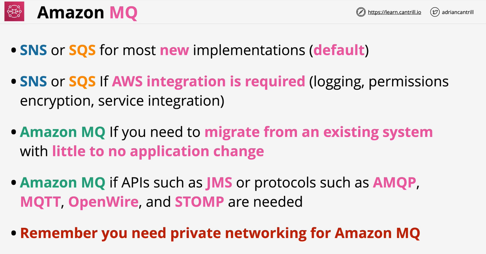

### Overview

- AmazonMQ is an AWS implementation of Apache ActiveMQ
- Open-source message broker
    - **JMS API** - open standard protocols such as **JMS, AMQP, MQTT, OpenWire and STOMP**
- Provides **QUEUES** and **TOPICS**
- Many ORGs already use topics and queues
- One-to-One or One-to-Many
- **Single Instance** (Test, Dev, Cheap), or **HA Pair** (Active/Standby)
- VPC service - NOT A PUBLIC SERVICE - PRIVATE networking required
- NO AWS native integration
    - delivers activeMQ product which you manage

