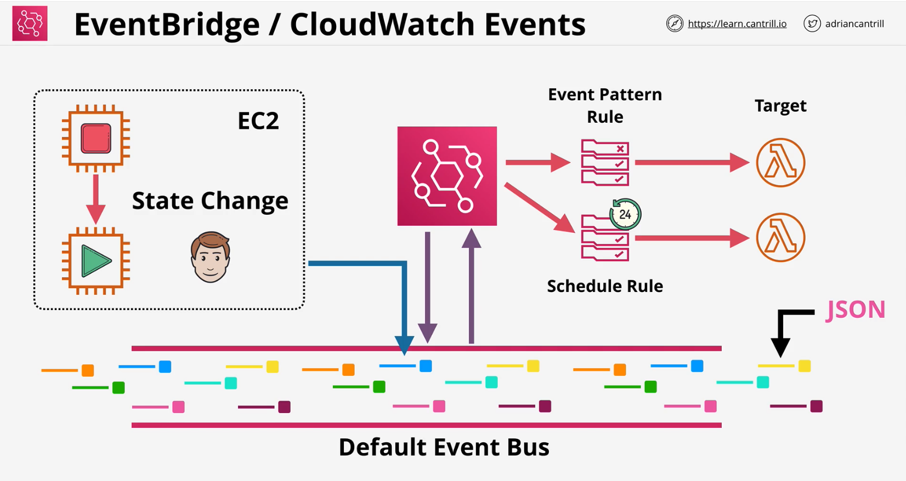

### Concepts
- **Default Event Bus**
    - can create aadditional event buses
- Support 3rd party applications too
- **Event Pattern Rule** matching incoming events  
- **Scheduled Rule** based rules also available
- **Rules** execute againt the **targets**
    - Lambda Function

