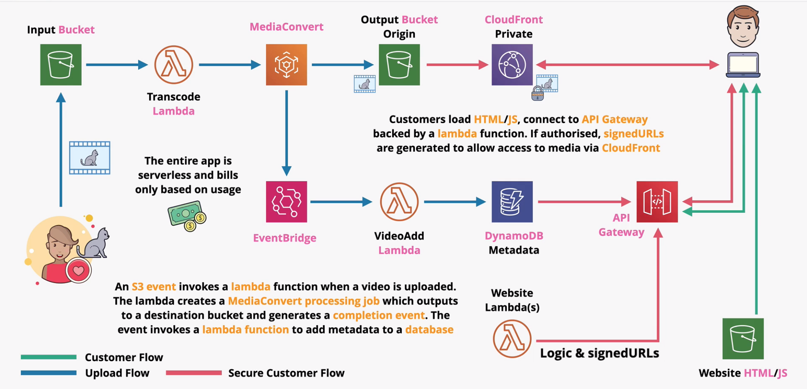

### Elemental MediaConvert (MC) & Elastic Transcoder (ET)
- File-based video transcoding services
- MC ~= v2 of ET (almost)
- Serverless - pay for resources used
- Add jobs to pipelines (ET) or Queues (MC)
- File loaded from S3, processed, stored on S3
- MC supports EventBridge (CWEvents) for job signaling

#### When and what to use ??
- ET is legacy, default to MC
- MC supports more codecs, and is designed for larger volume and paralled processing
- MC supports reserved pricing ..
- ET for WebM (VP8/VP9)
- ET for animated GIF
- ET for MP3, FLAC, Vorbis and WAV
- Everything else .. MC