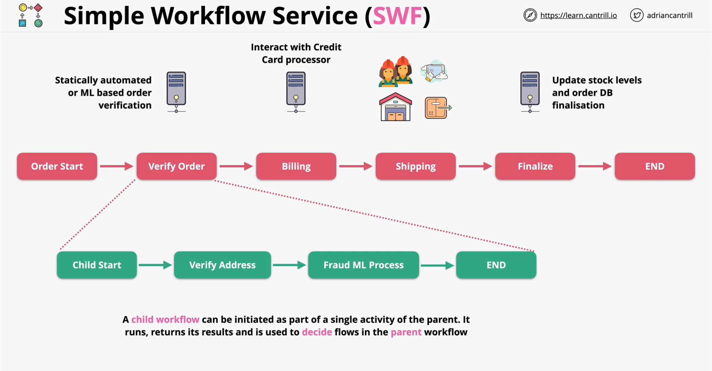

### Simple Workflow Service - SWF

#### Overview
- Build workflows - cordination over distributed components
- Predecessor to Step Functions - uses Instances/Servers
- Same patterns/anti-patterns - long running `workflows`
- Activity Task and Activity Worker
- Decider
    - schedule task
    - provides inputs to activity worker
    - process events while workflow is in progress
    - ends the workflow when objective has been completed
- 1 years of maximum runtime

#### SWF vs step-functions
- Default - Step Functions - serverless/lower admin
- AWS Flow Framework --> SWF
- External Signals to intervene in process -> SWF
- Launch child flows - return to parent -> SWF
- Bespoke/complex decisions -> SWF (customer decider applications)
- Mechanical Turk -> SWF (suggested AWS architecture)
- Over time Step Functions will replace SWF

