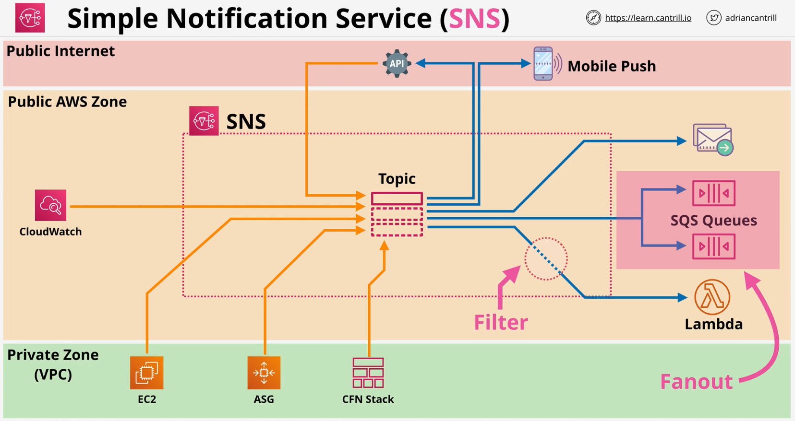

### Simple Notification Service
The Simple Notification Service (SNS) is a pub/sub system in AWS for the reliable delivery of notification style messages between AWS components or between AWS and external systems.

- **Public AWS Service** - network connectivity with Public Endpoint
- Coordinates the sending and delivery of **messages**
- Messages are **<=** **256KB** payloads
- **SNS Topics**  are the base entiry of SNS - **permissions** and **configurations**
- A **publisher** sends messages to a **TOPIC**
- **TOPICS** have **Subscribers** which receive messages
    - HTTPs, Email(-JSON), SQS, Mobile Push,SMS Messages & Lambda
- SNS used across **AWS for notifications** - **e.g.** CloudWatch & CloudFormation

- **Subscription Filter** - filter to send only to selective subscribers
- **SNS Fanout** - fanout to multiple SQS

- Delivery **Status** - (including HTTP, Lambda, SQS)
- Delivery **Retries** - Reliable Delivery
- **HA** and **Scalable** Region
- Server Side Encryption (**SSE**)
- Cross-Account via **TOPIC Policy**

 

