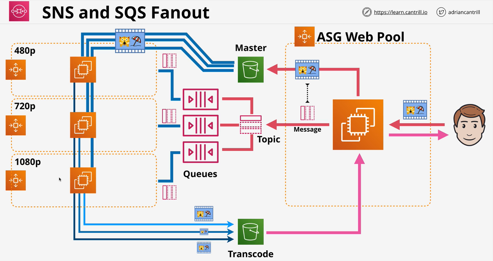
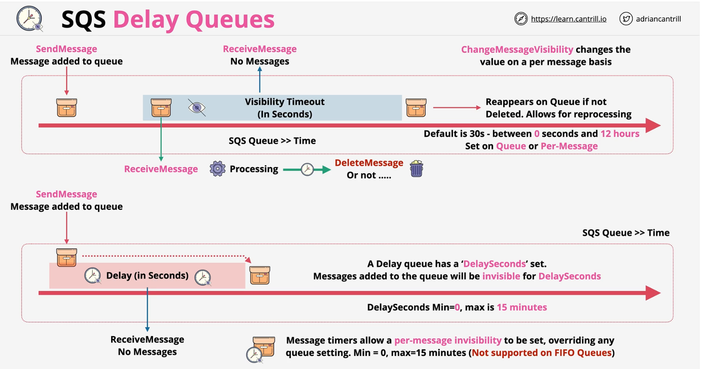
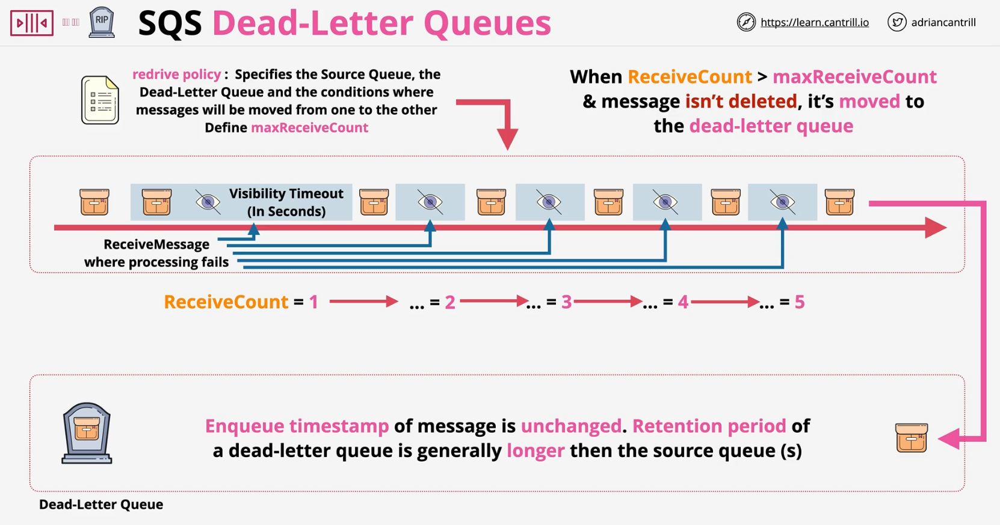

### Simple Queue Service
SQS queues are a **managed message queue service** in AWS which help to **decouple application components**, allow **Asynchronous messaging** or the implementation of worker pools.

- **Public, Fully Managed, Highly-Available Queues**
- **Standard**
    - Messages could be out of order - best effort
- **FIFO**
    - Messages are always in order - First In First Out
- **Messages** can upto 256KB
    - Messages > **256KB** can be uploaded to S3 and the link can be sent as message
    - Messages can stay in queue upto **14 days**
    - Encryption at rest (**KMS**) & in-transit
- **Visibility Timeout** 
    - Duration of time for which the message is **hidden** from the queue while it is being processed
    - If the message is not being deleted after processing and `visibility timeout` expires, the message will reappear in the queue
- **Dead-Letter queues**
    - Problematic messages can be sent to thi queue
    - **e.g.** - message is not being able to proccessed succesfully after 5 retries
- **ASGs can scale** and **Lambdas invok** based on the queue length
- **Queue Policy** - resource policy

### Standard vs FIFO queue
|Standard queue| FIFO queue|
|--|---|
|At-Least-Once Delivery|Exactly-Once Processing |
|Best-Effort Ordering |First-In-First-Out Delivery  |
| <b>Unlimited Throughput</b><ul><li>nearly unlimited number of API calls per second, per API action</li></ul> | <b>High Througput</b> <ul><li>300 api calls per second</li><li>3000 transactions per second with batching (batch of 10 messages)</li></ul> |
| <b>Use Cases</b> <ul><li>Decouple live user requests from intensive background work: let users upload media while resizing or encoding it.</li><li>Allocate tasks to multiple worker nodes: process a high number of credit card validation requests.</li><li>Batch messages for future processing: schedule multiple entries to be added to a database.</li></ul> | <b>Use Cases</b> <ul><li>Make sure that user-entered commands are run in the right order.</li><li>Display the correct product price by sending price modifications in the right order.</li><li>Prevent a student from enrolling in a course before registering for an account.</li></ul> |

**Pricing is based on requests or polling**

|short polling| long polling (waitTimeSeconds) |
|---|---|
| <b> ReceiveMessage</b> request queries only subset of servers for messages| <b> ReceiveMessage</b> request queries all of the servers for messages|
| Amazon SQS sends the response right away, even if the query found no messages.|  Amazon SQS sends a response after it collects at least one available message, up to the maximum number of messages specified in the request. Amazon SQS sends an empty response only if the polling wait time expires.|

### SQS Extended Library
- Used when handling messages over SQS max (**256KB**)
- Allow large parylowd - **stored in S3**
- **SendMessage**, uploads to **S3**, stores link in **message**
- **Receive  message** loads large payload **from S3**
- **Delete message** also **deletes large S3 payload**
- Interface for SQS + S3 - handling the integration workload
- Exam often mentions JAVA with Extended Client Library

### SQS Delay Queues
[Amazon SQS delay queues](https://docs.aws.amazon.com/AWSSimpleQueueService/latest/SQSDeveloperGuide/sqs-delay-queues.html)

### SQS Dead-Letter Queue
Dead letter queues allow for messages which are causing repeated processing errors to be moved into a dead letter queue

> Enqueue Time is not adjusted for message when it is being moved from normal to dead letter queue

