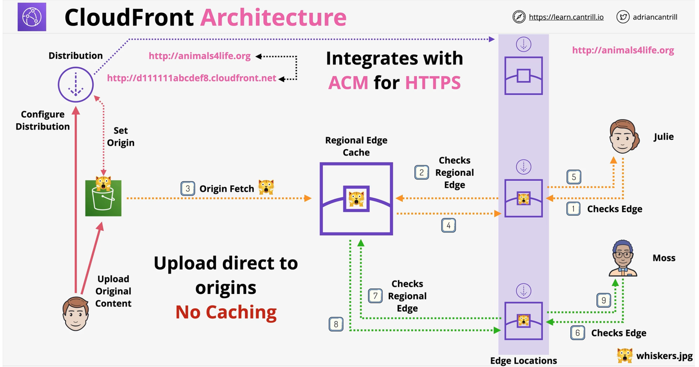
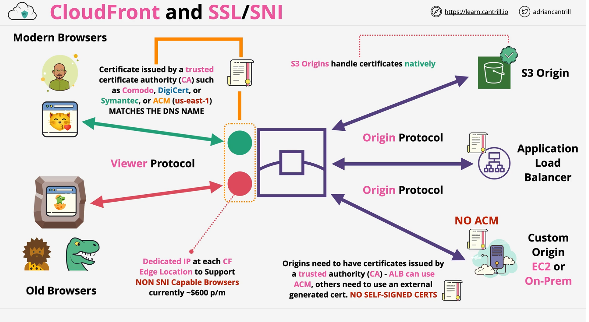
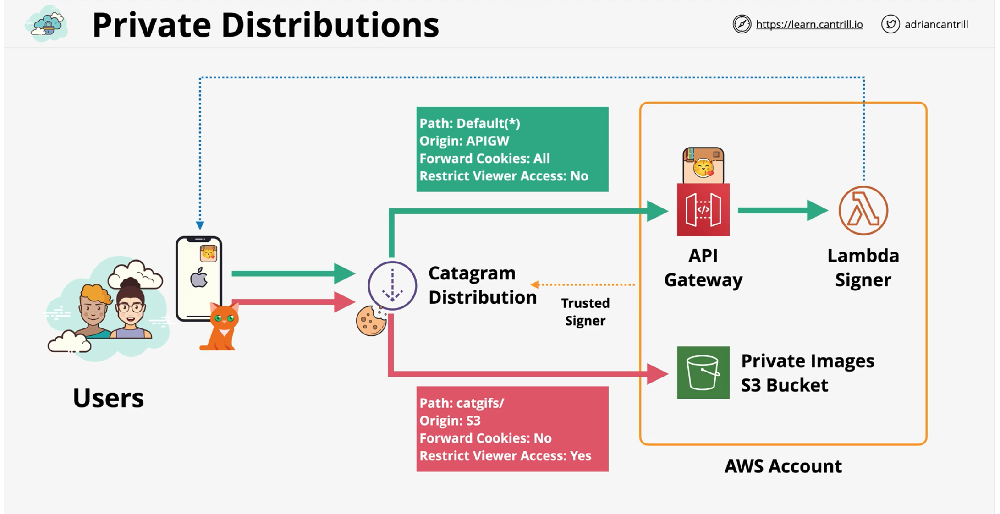
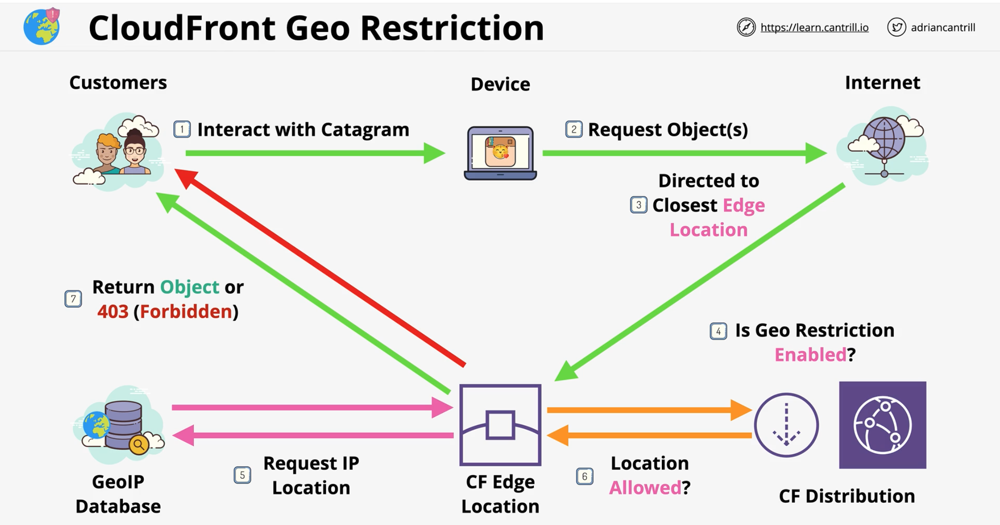
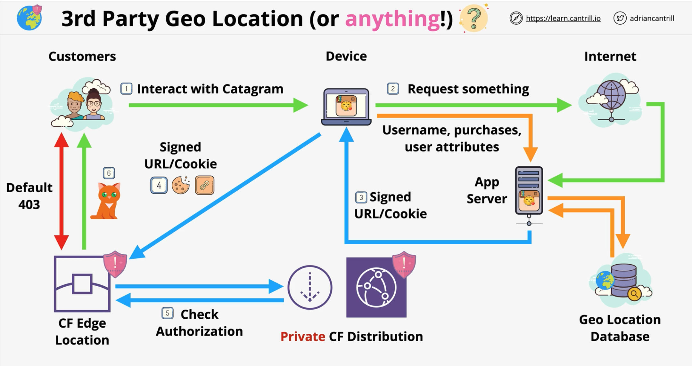

### CloudFront
CloudFront is a Content Delivery network (CDN) within AWS.
- higher latencies and slow transfer speeds (customers across the globe)
- solve by using caching and efficient global network

#### Terms
- **Origin** - S3 origin or custom origin (publicly routable IP address)
- **Distribution** - configuration unit of CloudFront
    - can have multiple origins configured
- **Edge Location** - Local cache of your data 
    - smaller than regions - 200 edge locations
- **Regional Edge Cache**
    - only used by custom origin **NOT** S3 origin
    - larger version of edge location. Provides another 
    - provides another layer of caching
---

#### Cache Behavior
- Default (*) - **path-pattern**
- trusted signers/groups for private

To delete all cache behaviors in an existing distribution, update the distribution configuration and include only an empty CacheBehaviors element.

https://docs.aws.amazon.com/cloudfront/latest/APIReference/API_CacheBehavior.html

#### TTL
- more frquent cache HITS == lower orign load
- Default TTL (defined in the behavior) == 24 hrs (validity period)
- **Minimum TTL** and **Maximum TTL** - default applies if not specified
  - limits the object level TTL values
- Origin Header: **Cache-Control max-age** (seconds)
- Origin Header: **Cache-Control s-maxage** (seconds)
- Origin Header: **Expires** (Date & Time)
- Headers can be set using custom origin or s3 origin (via object metadata)

#### Invalidations (cache)
- Cache invalidation - performed on a distribution
    - applies to all edge locations - process takes time
- Examples of cache invalidations - correct errors
  - /images/whiskers1.png
  - /images/whiskers*
  - /images/*
  - /*
- Versioned file names ..  file_v1/file_v2/file_v3 
    - avaoid caching issues - names are different
    - logging is more clear
    - no frequent cached invalidations

#### SSL
- CloudFront **Default Domain Name** (CNAME)
    - ex - https://random.cloudfront.net/
- SSL supported by default ... ***.clodufront.net** cert
- **Alternate Domain Names** (CNAMES) ex- cdn.something.com
    - verify ownership (optionally HTTPS) using a matching certificate
    - generate or import certs in ACM 
    - add certficate in **us-east-1** for global service like CloudFront
- Cloudfront to allow on one of the options: HTTP or HTTPS, HTTP => HTTPS, HTTPS Only
- Two SSL connections Viewer => CloudFront &  CloudFront => Origin
    - both need valid public certificates (intermediate certs)

#### SNI - Server Name Indication
- SNI is a TLS extension, allowing a **host to be included** -- free of cost
    - host header routing ->> allows multiple hosts/certs behind a single IP 
    - old browsers don't support SNI .. CF charges extra for dedicated IP ($600)

---

#### Origin Types an Architecture
- Origins
    - aws s3 
    - aws media package channel endpoints
    - aws media storage container endpoints
    - everything else (custom origin) -- web servers

- Custom origin options:
    - SSL protocol - TLS certs
    - origin id, domain name, path
    - origin protocol
    - custom ports
    - custom headers
    - connection configuration

#### Caching Peformance & Optimization
- **CACHE HIT** = object returned from cache
- **CACHE MISS** = object returned from origin 
- Headers, Cookies and Query String Parameters can be configured to be forwarded to the origin or not
- Forward what the application needs 
- **Cache based** on what can **change the objects**
- The **more** things are involved in caching - the **less efficient**

####  Origin Access Identity (OAI) - S3 Origin
- applicable to S3
- type of identity
- assocaited with **Cloudfont Distribution**
- CloudFront 'becomes' that **OAI**
- **OAI** can be used in the **s3 bucket policies**
    - DENY all but ALLOW one or more **OAI's** in bucket policy

#### Securing Custom origins
- custom origin to require some **custom headers **
    - **custom headers** are injected within the **cloudfront**
- custom origin to host behind **firewall** which allows only **public IP ranges of cloudfront **

#### Private Distributions
- Public - open access to objects
- Private ... requests required signed Cookie or URL
- 1 behavior --> whole distribution PUBLIC or PRIVATE
- Multiple behaviors - combination of PUBLIC and PRIVATE
- **CloudFront Key** 
    - created by root account user and tied to a specific AWS account
    - account with cloudfront key can be added as **TRUSTED SIGNER**
    - will require signed cookie/url
- **Signed URL** 
    - provides access to one object 
    - Legcy RTMP distributions cant use cookies
    - use **URL's** if the client does not support cookies
- **Signed Cookies**
    - Use for **groups** of files/**all files of a type** - .jpeg
    - maintain the URL with signed cookies
---

#### CloudFront Geo Restriction

|CF Geo REstriction| 3rd party Geolocation|
|--|---|
|Whitelist or Blacklist - COUNTRY ONLY| completely customizable|
| GeoIP Database 99.8%+ Accurate| more accurate - can be filter on many attributesc|
| applies to the entire distribution | |
|  |  |

#### CloudFront Field-Level Encryption
- Client <==> Origin can be encrypted using HTTPS
    - data transmitted within is treated like any other plain data
- Field Level encryption happens at the edge
    - happens separately from the **HTTPS Tunnel** using public/private key
    - private key is needed to decrypt individual fields

#### Lambda@Edge
- run lightweight lambda at edge locations
- adjust data between the viewer and origin
- only supports node.js and python
- runs in the AWS public space --> cannot access any VPC resource
- lambda layers not supported
- different limits than normal lambda function

- **Use Cases**
    - A/B testing - **Viewer Request**
    - Migration between s3 oriigns - **Origin Request**
    - Different Objects based on Device - **Origin Request**
    - Content By Country - **Origin Request**

#### ElasticCache
- in-memory database .. high performance
    - managed redis and memcached -- as a service
- can be used to **cache data** - for READ HEAVY workloads with low latency requirements
- Reduces database workloads (expensive)
- Can be used to store Session Data (Stateless Servers)
- requires application code changes

|Memcached|Redis|
| :--- | :--- |
|simple data structure - string|advance structure- list, sets, sorted lists, bit-arrays|
|No replication|Multi-AZ|
|Mulitple Nodes(Sharding)|Replication(Scale Reads)|
|No backups|Backup & Restore|
|Multi-threaded|Transactions|
