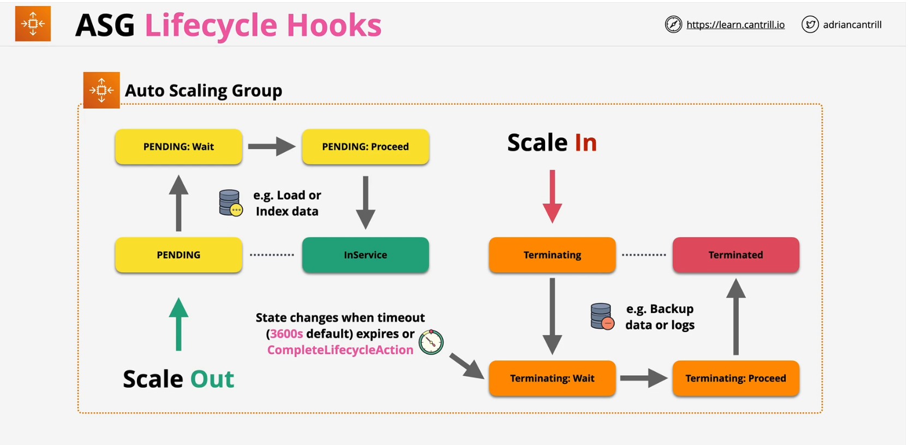

### Overview
- **Automatic Scaling** and **Self-healing** for EC2
- Uses **Launch Templates** or **Configurations**
- **min,desired and max** => **min <= desired <= max**
    - desired is maintained by provisioning and terminating the instances
- ASGs are free
- use cool downs
- smaller instances - granularity

### Scaling Policies
- **Manual** Scaling - Manually adjust the desired capacity
- **Scheduled** Scaling - Time based adjustment

**Dynamic Scaling**
- **Simple Scaling** - Add 1 for CPU (metric) > 50 and Remove 1 for CPU (metric)  < 50
- **Stepped Scaling** - Bigger +/- based on difference
- **Target Tracking** - Desired Aggregate CPU = 40% .. ASG handle it

- **Cooldown Peiod (s)** - wait at end of the scaling activity to evaluate 

- **EC2** instance check for health check

### ASG + Load Balancers
- **ALB --> Tagret Group (TG) --> ASG**
    - targets in TG is automatically updated by ASG
    - app health check con be configured by TG

### Scaling Process
- **Launch and Terminate** - SUSPEND and RESUME
- **AddToLoadBalancer** - add to LB on launch
- **AlarmNotification** - accept notification from CW
- **AZRebalance** - balances instances evenly accross all of the AZs
- **HealthCheck** - instance health checks on/off
- **ReplaceUnhealthy** - Terminate unhealthy and replace
- **ScheduledActions** - Scheduled on/off
- **Standby** - use this for instances `InService vs Standby`

### ASG Lifecycle Hooks
Lifecycle hooks enable you to perform custom actions by pausing instances as an Auto Scaling group launches or terminates them.

- **Custom Actions** on instances during **ASG actions**
    - instance launch  or instance terminate transitions
- Instances are paused within the flow.. they wait
    - until lifecycle actions completed using `complete-lifecycle-action` command or `CompleteLifecycleAction` operation
    - **OR** until the timeout period ends (one hour by default)  - CONTINUE or ABANDON
- Integrates with **SNS, SQS and EventBridge** 

