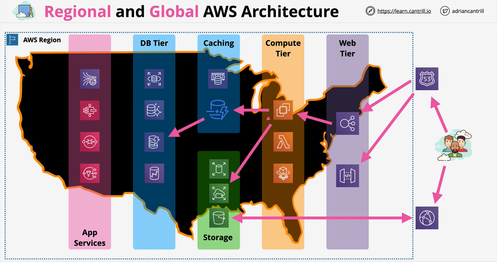
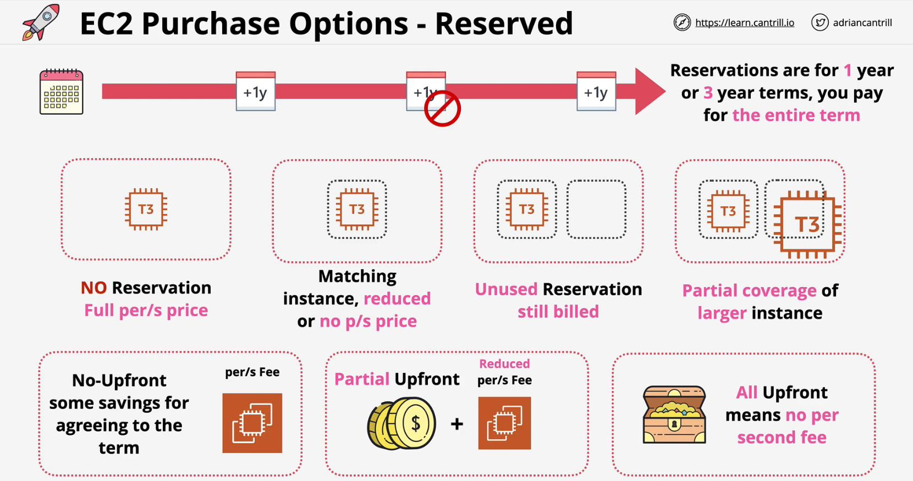
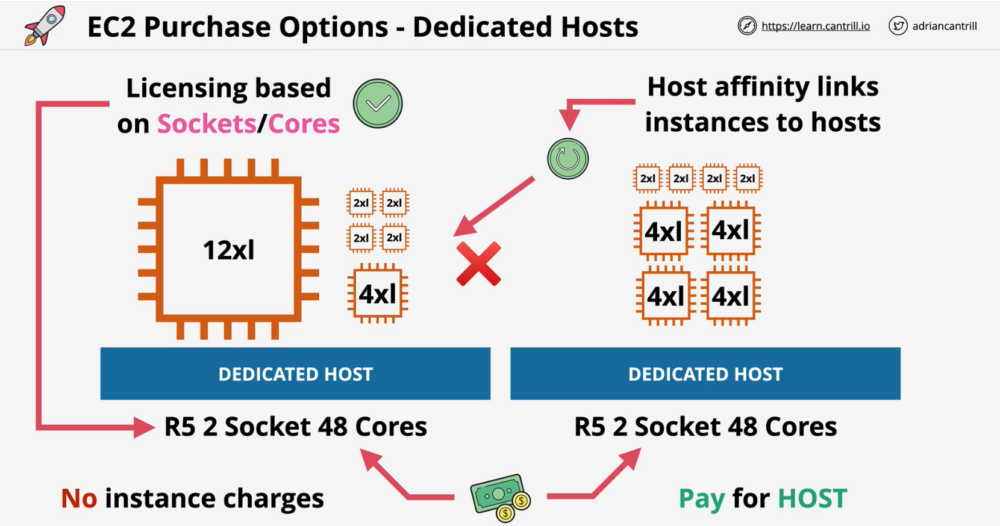
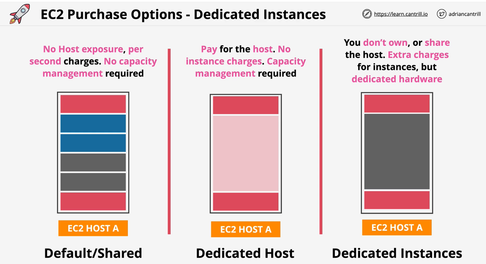

### Regional and Global AWS Architecture

### EC2 Purchase Options (Launch Types)
#### On-Demand
- Instances are isolared but multiple customer instances run on shared hardware
- **Per-second** billing while an instance is **running**
- **Default** purchase option
- No **upfront cost and discount**
- **Predictable** pricing
- Apps which **cannot be interrupted**

#### Spot
- Cheapest to launch EC2 instances
- SPOT pricing is AWS **selling unused EC2 host capacity** for **upto 90% discount**
    - the spot price is based on the **spare capacity at a given time**
- As long as the customer price is lower than the spot price, instances are provisioned else they are terminated
- Use for non time critical workloads which are stateless and cost sensitive.
    - workloads which can be **re-run** 
- Never use SPOT for workloads that can't tolerate interruptions

#### Reserved
- Long-term consumption of EC2 instances - at a discounted price
- **Unused** Reservation **still billed**
  
 

**Scheduled Reserved instances**

- Ideal for **long tern usage** which **which doesn't run constantly**
    - Batch processing **daily** for **5** hours starting at 23:00
    - **Weekly** data, sales analysis.. every **Friday** for **24 hours**
    - **100 hours** of EC2 per **month**
- Doesn't support all isntance types or regions
- 1200 hours per year & 1 year term minimum

**Capacity Reservations**

Reserved purchases -> on-demand -> spot (in priority order)

- **Regional Reservation** - provides a **bililing discount** for valid instances launched in any **any AZ in that region**
    - but don't reserve instances within an AZ
- **Zonal Reservation** - only apply to one AZ providing billing discounts and capacity reservation in that AZ
- **On-demand capacity reservations** can be booked to ensure you always have access to **capacity in an AZ** when you need it
    - **full on-demand** price
    - no term limits
    - you pay **regardless of if you consume it**
    - no savings

#### Dedicated Hosts
- **Pay** for **HOST**
- **No** instance charges
- **Use case -** Licensing based on **Sockets/Cores** where host affinity is important
- **Host affinity links instances to hosts**
    - can launch multiple instances with multiple instance types
    - maximum capacity to launch the no. of instances
    - customer still have to manage host capacity

#### Dedicated Instances
- Don't own the host but do not share the host - extra cost for the instances, but **dedicated hardware**
- Requirement where hosts cannot be shared.

### EC2 Savings Plan
- A **hourly commitment** for a **1** or **3** year term
- A reservation of **general compute \$ amounts** ($20 per hour for 3 years)
    - or a  specific **EC2 Savings Plan** - flexibility on size and OS
- Compute products (currently) - **EC2**, **Fargate** & **Lambda**
- Products have an **on-demand rate** and a **savings plan** rate
- Resource usage consumes savings plan commitment at the reduced savings plan rate
- Beyond the commitment, the pricing is switched to **on-demand rate**

### EC2 Networking
[Elastic network interfaces](https://docs.aws.amazon.com/AWSEC2/latest/UserGuide/using-eni.html)
- **ENI** - Elastic Network Interface
- **Primary ENI** is created when instance is created and **cannot be removed** and **deleted** when instance is terminated
- **Additional ENIs** (secondary ENIs) can be added in and removed from other subnets(**multi homed**) but NOT in other AZs

**WHY multiple ENIs** ?

- **Security groups** is attached to the **ENI**
- Multiple **SGs** to control access to **EC2 instances** - different **protection rules**
- Different **NACL** for different subnets and secondary **ENIs** can be placed into different subnets from subnet where primary ENI is created
- Each EC2 has **1 primary private IPv4 address** - same for lifecycle of the EC2
    - primary IP is visible to **OS**
    - depending on the instance type, **1 or more** no. of **secondary private IPs** can be allocated to the instance and those **IPs** are also visilble to the OS
    - secondary IPs can be attached and detached from the instances
- **Public IPv4 address** assigned to EC2 instance is **not static** and not **visible to the OS**
    - elastic IP per private IPv4 (to make static) - associate with primary interface
- **ENI** can have 1 or more IPv6 addresses (all publicly routable)
    - 1 MAC address
    - 1 or more Security Groups
- **ENI** `source/destination` check
    - disable them for instance instance running services such as **network address translation, routing, or firewalls**
---
**Use Cases for multiple ENIs**
<ul style="color:orange;font-weight:bold">
    <li>Management or isolated nteworks</li>
    <li>Software Licensing (MAC) </li>
    <li>Security or Network Appliances</li>
    <li>Multi-homes instances with workloads/roles on specific subnets</li>
    <li>Low Budget & Simple High-Availability solutions</li>
</ul>

### Bootstrapping vs AMI

Bootstrapping or AMI Baking are two ways to influence the speed of EC2 deployments - and how flexible those deployments can be.

- Software installation can be extracted from bootstrapping and move to AMI
    - app, tools and languages dependencies baked into AMI
    - quick and ready to deploy - launch many instances from the AMI
- Bootstrap running executable (binary and containers)
- Combination of AMI baking and bootstrap for maximum efficiency

### EC2 Placement Group
> HPC = High Performance Computing
#### Cluster Placement Groups
- Pack instances close together
- **Best Practise** - launch all the instances at the same time (use same instances type)
- **Performance focused** - launched in **single AZ** - **same rack** and **sometimes same host**
- All members have direct connetions to each other 
    - low latency and node-to-node communications - **typical of HPC applications**
    - use **instances with high performance** as well as use **enhanced networking**
  
- **Tradeoff** - No resiliency since all the instances are placed in the same AZ
    - AZ is locked when launching first instance
- Can span VPC peers - but impacts performance
- Requires supported instance type

#### Spread Placement Groups
- Strictly places a small group of instances across distinct underlying hardware(distinct rack) accross multiple AZs
    - HARD LIMIT - 7 Instances per AZ
- Provides infrastructure isolation
    - each racnk has its own network and power source
- Not supported for Dedicated Instances or Hosts
- **Use Case** - small no. of critical instances that need to be kept sepeated from each other

#### Partition - groups of instances spread apart
- Maximum of  **7 partitions** per AZ
    - each partition has it own rack - no sharing between partitions
- Instances can be placed in **a specific partition** OR auto placed
- Large distributed and replciated workloads such as Hadoop, Cassandra and Kafka
- Contain the impact of failure to specific part of an application