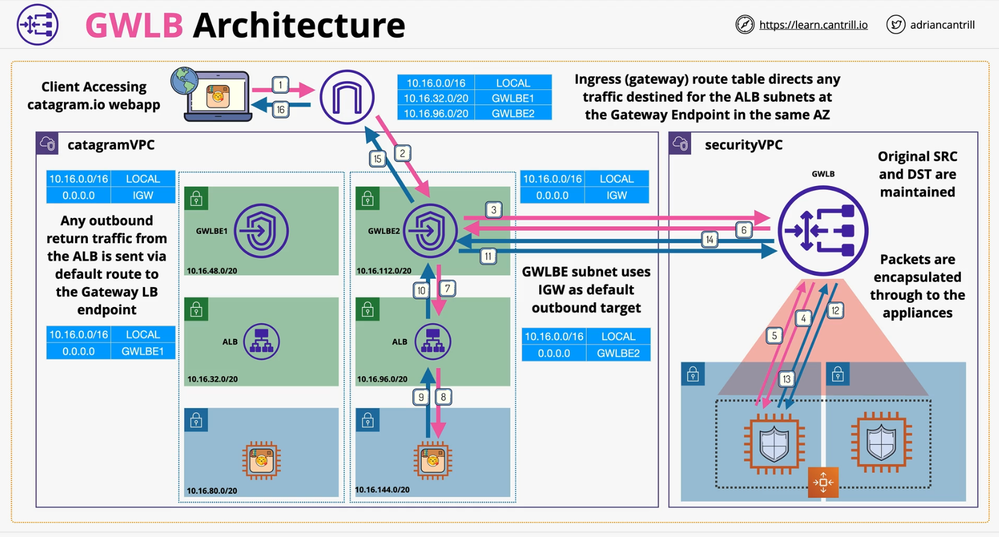

### ELB architecture
- IPv4 or Dual stack ( IPv4 + IPv6)
- Public (internet-facing) vs  Private (internal-facing: only private address)
    - internet-facing can connect to both private and public instances
- A **DNS record** is asigned to the load balancer
- LB nodes are **distributed in multiple AZs** and **resolved via DNS record** assigned to the Load Balancer
- At least **8+ free IPs** per subnet & **/27 or larger** subnet to allow for scale

**CROSS-ZONE LB**

- Each node can forward traffic to a different zone that it is located in
- **Enabled by default in ALB** and **disabled by default in NLB and CLB**.
    - disabling can create uneven distribution of load across compute behind

### Session State
- Server-side piece of information
- Use external session storage to avoid disruption from instances failures

### Application Load Balancer vs Network Load Balancer
CLB doest not scale... every unique name requires an inidivual CLB because SNI is not supported

> SNI - Server Name Indication

#### **ALB** - Applicaiton Load Balancer
- **Layer 7** Load balancer.. listens on **HTTP** and/or **HTTPS**
- **No other Layer 7 protocols (SMTP, SSH, Gaming)**
    - NO TCP/UDP/TLS Listerners
- L7 content type, cookies, custom headers, user location and app behavior
- HTTP HTTPS (SSL/TLS) always terminated on the ALB - no unbroken SSL (security teams)
    - **a new connection** is made to the application
- ALB MUST have SSL certs if HTTPS is used
- ALBs are slower than NLB.. more levels of the network stack to process
- Health checks **evaluate application health**.. layer 7

**Rules**

- Rules **direct connections** which **arrive** at **listener**
- Proccessed in **priority order**
- **Default rule** = catchall
- **Rule conditions**: host-header, http-header, http-request-method, path-pattern, query-string & source-ip

#### **NLB** - Network Load Balancer
- **Layer 4 load balancer** .. **TCP, TLS,UDP, TCP_UDP**
- No visibility or understanding of **HTTP** or **HTTPS** 
- No headers, no cookies, not session stickiness
- Reallly Really Really Fast (**millions of rps, 25%  of ALB latency**)
    - can deal with **SMTP, SSH, Servers, finanacial apps** (not https) 
- Health checks **JUST** check ICM/TCP Handshake (**not app aware**)
- NLB's  can have **static IP's** - useful for whitelisting
- **Forward TCP** to instances - **unbroken encryption**
- Used with private link to provide services to other VPCs

### Session Stickiness
- Applications not leveraging extenal session storage can use `session stickiness` feature from ELB to manage the user session internally
- **Locks a session** to `1 backend instance`
- `AWSALB` cookie is used - `1s to 7 days` duration
    - new cookie is issued if backend instance goes down (unheathy)
    - new cookie is issued if the cookie itself expires
- can create uneven load for backend instances
- Key points - `logout, lost,carts, lost progress` => **lost session state**

### Gateway Load Balancer - GWLB
Gateway Load Balancers enable you to deploy, scale, and manage virtual appliances, such as firewalls, intrusion detection and prevention systems, and deep packet inspection systems. 

- Run and scale 3rd party appliances
- Example - **firewalls, intrusion detection and prevention systems**
- **Inbound and Outbound traffic** (**transparent** inspection an protection)
- **GWLB Endpoints** (VPC) ->  traffic enters/leaves via these endpoints
- **GWLB** -> balances accross **multiple backend appliances**
    - forward traffic without modifying it using tunnel
- **GENEVE protocol** -> tunneling protocol (between GWLB and backend instances)
- Traffic and metadata is tunnelled using **GENEVE** protocol

- **IGW** is configured with ingress routed table (gateway route table)
 
 

