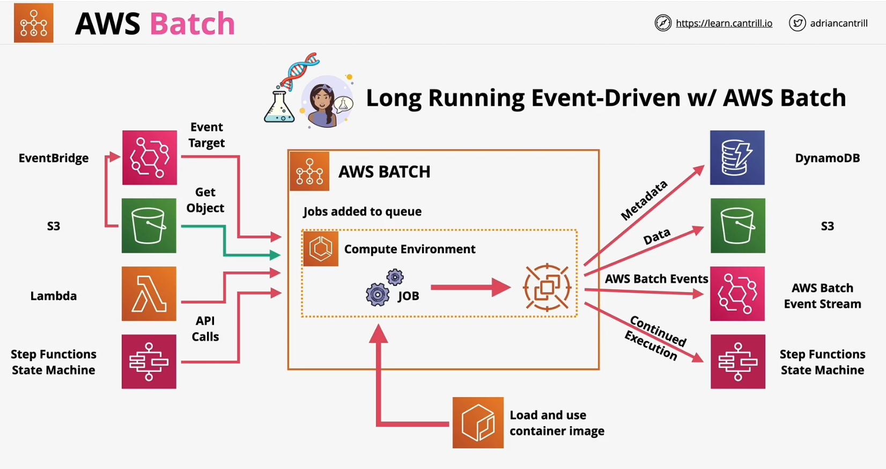

### Overview

- AWS Managed `Batch processing` Product
- Batch processing - jobs that can run **without end user interaction** or can be scheduled to run **as resources permit**
- Lets customer **define jobs** and it handles **compute** and **orchestration**
- Let overcome `15 minutes` limitation of AWS Lambda
- It can be dropped into many event-driven workflows for jobs which go beyond the capabilities of Lambda.

### Components
- **Job** 
    -  Script, Exeuctable or Docker container submitted to batch
    -  can reference other jobs by name or ID
    -  cna be dependent on the successful completion of other jobs
- **Job Definitions** 
    - MetaData for a job
    - IAM Resources
    - Resource config - cpu and memory
    - Environment vars and mount points

- **Job Queues**
    - **Jobs are submitted to a queue**
    - Batch job resides until it is scheduled onto a compute environment.
    - can associatew one or more compute environments with a job queue
- **Compute Environment**
    - **Managed Compute Environment**
        - Batch manages the capacity based on workolads
        - You can choose EC2 isntances - **On-demand** or **Spot** Instances - size./type
        - You can determine your own **max spot price**
        - VPC - **Public/Private** -- requires VPC gateways
    - **Unmanaged Compute Environment**
        - You manage your own compute resources in the enviroment
        - Resources like AWS ECS cluster
        - Redirect batch to use your own managed resources
- **High** or **low** priority environment

### Integration
