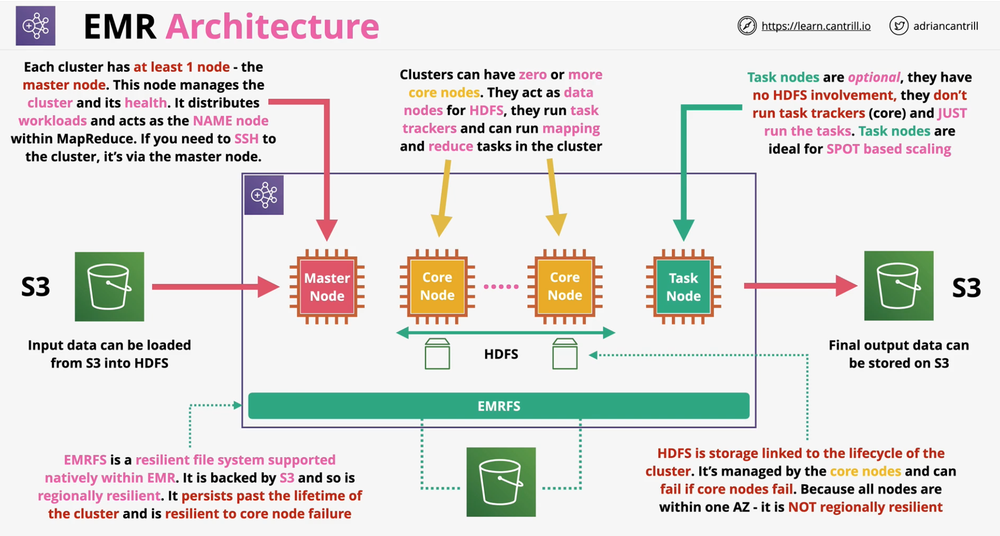

### MapReduce
MapReduce is a process for large scale parallel processing of large datasets

- Data Analysis Architecture - **huge scale, parallel processing**
- MAP & REDUCE
- Data is seperated into `splits` and each assigned to `mapper`
- Perform Operations at scale - customisable
- **Recombine** Data into Results
- **HDFS** - Hadoop File System
- Stored across **multiple data nodes**
- **Highly Fault-tolerant** - **replicated** between nodes
- **Name Node** - provides the `namespace` for file system & **controls access to HDFS**
- **Block** .. segment of data on HDFS.. **generally 64 MB**

### EMR
Elastic Map Reduce (**EMR**) is the AWS Managed implementation of EMR/Hadoop within AWS.

- AWS Managed Implementation of **Apache Hadoop**
    - and **Spark, HBase, Presto, Flink, Hive, Pig...**
- Can be operated **long-term** .. or use ad-hoc (**transient**) clusters
- Runs in **One AZ** in a **VPC** using **EC2** for compute
- Auto Scales - **Spot, Instance Fleet, Reserved, On-demand**
- **Big Data** processing, manipulation, **analytics**, **indexing**, **transformation** and more .. data pipeline*
- **Node Type**
    - **Master Node**  (at least one in the cluster)
        - coordinate the distribution of data and tasks among other nodes for processing
        - tracks the status of tasks and monitors the health of the cluster
    - **Core Node** (zero or more nodes)
        - run tasks tracker and store data in the HDFS
        - can also run task
    - **Task Node** (optional)
        - node with software components that only runs tasks
        - does not store data in HDFS
        - ideal for **SPOT based scaling**
- **EMRFS** - **resilient file system supported** natively within EMR
    - backed by s3 
    - reigionally resilient
    - Persists past the lifetime of the cluster

