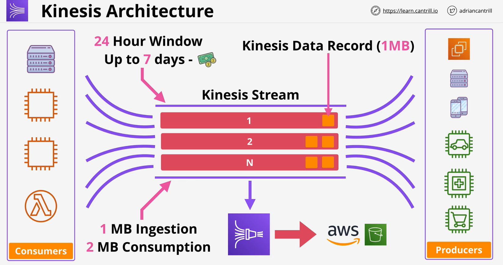
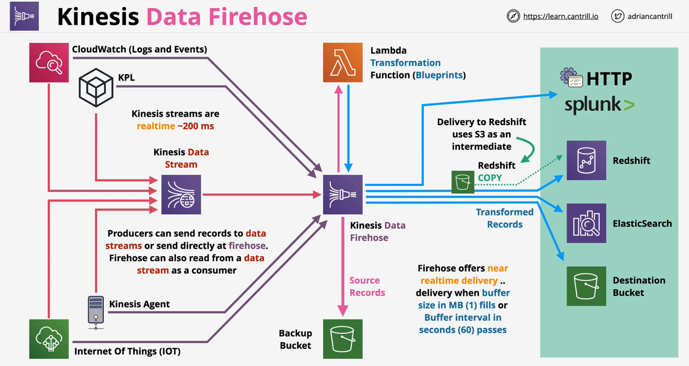
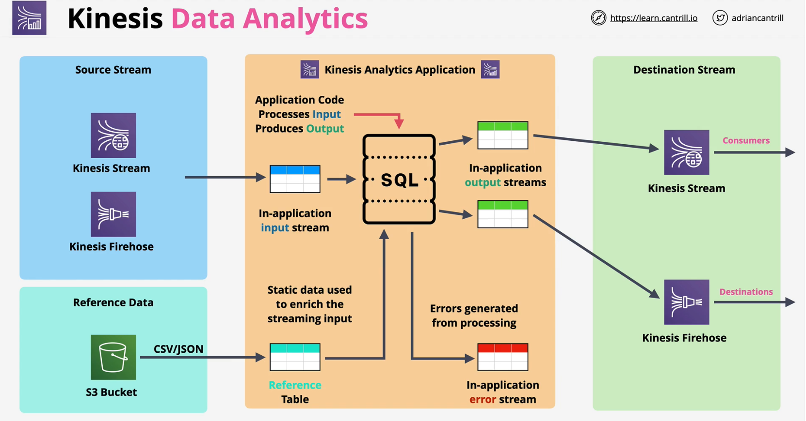

### Concepts

- Kinesis is a **scalable streaming** servcice
- Producers **send** data into a kinesis **stream**
- Streams can scale from low to near infinite data rates
- Public service &  highly available by design 
- Streams store a **24-hour** moving window of data (can be extended to 7 days for extra cost) 
- **Multiple consumers** access data from that moving window

[kinesis-cheat-sheet](https://tutorialsdojo.com/amazon-kinesis/)

### SQS vs Kinesis

|SQS|Kinesis|
|:--:|:---:|
|Async communication and decoupling of applicaion with worker pools| Huge scaled ingestion of data - throughput|
|One **Production group** <-> **One consumption** group| Multiple consumers - realtime or periodically|
| No persistence of messages, no window| **Window= 24 hrs** by default (**max 7 days**)|
||**Data ingestion, analytics, monitoring, app clicks**|

### Kinesis Data Firehose
- **Fully managed** service to load data for **data lakes, data stores ad analytical services**.
- **Automatic scaling**.. fully **serverless** and **resilient**
- **Near Real Time Delivery** (~60s)
- Supports **transformation** of data on the fly (lambda)
- **Biling** - volume through firehose
- **Exception** - copying the data to intermediary S3 bucket before sending it to Redshift

### Kinesis Data Analytics
Amazon Kinesis Data Analytics is the easiest way to analyze streaming data, gain actionable insights, and respond to your business and customer needs in real time.

- **Real time processing** of data
    - using **SQL**
- Ingests from **Kinesis Data Streams** or **Firehose**
- **Supported Destinations**
    - **Firehose** OR any fireshose supported destinations :arrow_down: :arrow_down:
        - S3, Splunk, HTTP, Redshift, ElasticSearch
    - AWS **Lambda** - realtime
    - Kinesis **Data Streams** - realtime

#### Use cases
- Streaming data needing **real-time SQL processing**
- Time-series anlytics - **elections/e-sports**
- Real-time dashboards - **leaderboards** for games
- Real-time metrics - **security & response** teams

