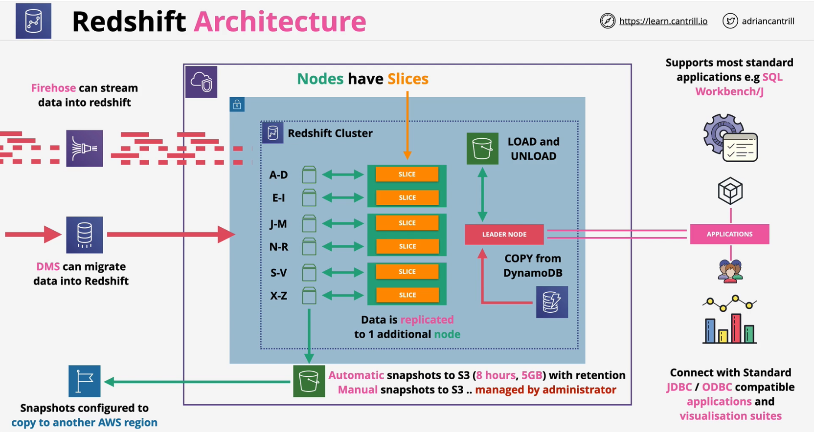

### Overview

- **Petabyte** scaled **Data warehouse**
- **OLAP** (**Column** based) not OLTP (row/transaction)
- Pay as you use . similar structure to RDS
- Directly Query S3 using **Redshift Spectrum** - withouot loading data to Redshift
- Directly Query other DBs using **federated query**
- Integrates with AWS tooling such as Quicksight
- SQL-like interface **JDBC/ODBC** connections

### Architecture
- **Server** based (not serverless)
- **One AZ** in a VPC - network cost/performance
- **Leader Node** - Query  input, planning and aggregation
- **Compute Node** - performning queries of data
- VPC Security, **IAM** Permissions, **KMS** at rest Encryption, CW Monitoring
- Redshift **Enhanced VPC Routing** - VPC Networking!!
    - traffic is routed via VPC configuration

### Resilience and Recovery
- S3 for backups
    - **Automated**  
        - every **~8 hours** or **5GB of data**
        - **1 day retention** (configurable to **35 days**)
    - **Manual**
        - snaps can be taken at any time
        - deleted by an admin as required 
- Snapshots can be **restored in different AZ or regions**
- Can be configured to **copy snapshots to another region for DR**- with a **seperate configurable retention period**
