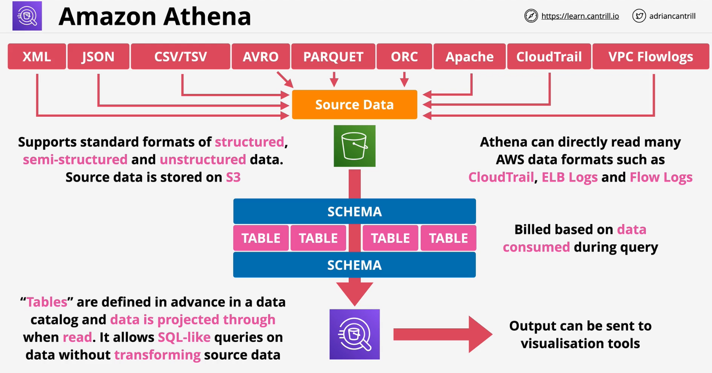

### Overview
- **Serverless** Interactive Querying Service -**NO INFRASTRUCTURE**
- Ad-hoc queries on data - pay only **data consumed**
- **Schema-on-read** - table-like translation
- Original data **never changed - remains on S3**
- Schema translates data => relational-like when read
- Ouput can be sent to **other AWS services**
- SQL like queries
- Queries where **loading/transformation is not desired**
- **Cost effective**
- Querying **AWS logs** - VPC Flow Logs,CloudTrail, ELB logs, cost reports
- AWS **Glue Data Catalog** and **Web Server Logs**
- w/ **Athena Federated Query** .. other data sources (non s3 sources)
    - using custom and pre-built connectors

 

