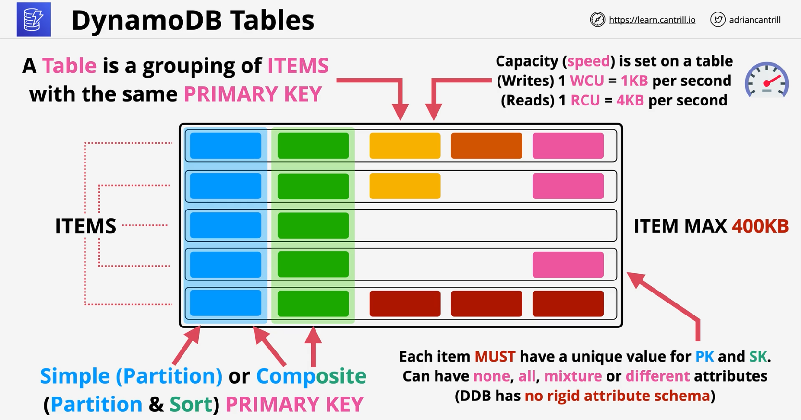
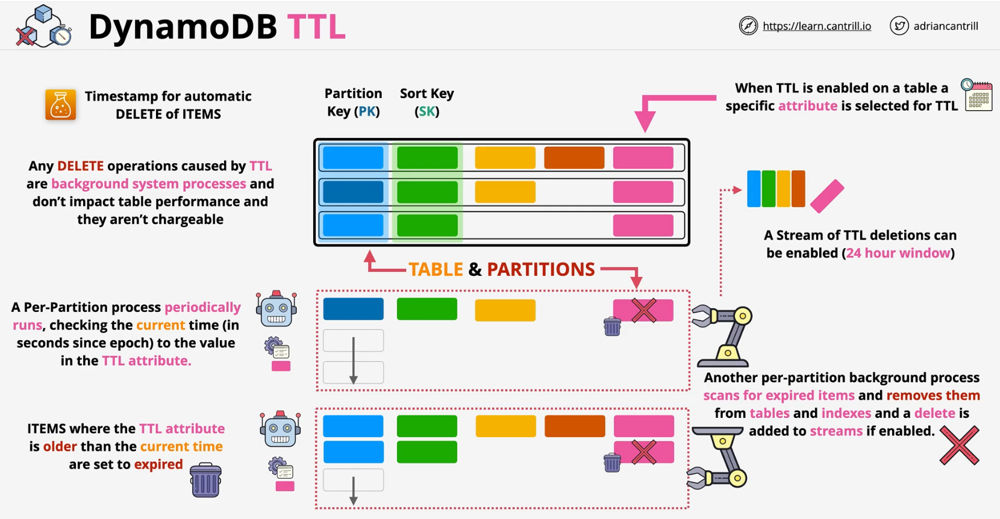

### Concepts
- **NoSQL** - **DBaaS** - **Key/Value & Document**
- **No self managed servers** or infrastructure
- Manual/Automatic provisioned performance IN/OUT or On-Demand
- **Highly Resiliient** .. accross AZs and optionally global
- Really fast .. **single-digit milliseconds** (SSD based)
- Backups, point-time-recovery, encryption at rest
- **Event-Driven Integration**

### Tables
- A table is grouping of ITEMS with the same primary key
- **PRIMARY KEY**
   - Simple partition key (**PK**) => Simple
   - Partition Key (**PK**) and Sort Key (**SK**) => Composite
- DDB has no rigid  attribute schema
- Each iterm **MUST** have a unique value for PK and SK
    - Item max size - **400KB**

**Capacity** - Speed
> WCU = Write Capacity Unit
> RCU = Read Capacity Unit
- **1 WCU** = 1KB per second
- **1 RCU** = 4KB per second

 

### On-Demand Backups
- Full copy of table - retained until removed
- Restore
    - **Same or Cross region**
    - **With or Without Indexes**
    - **adjust Encryption Settings**

### Point-in-time Recovery (PITR)
- Enabled on the table - disabled by default
- 35 day recovery window
    - Continuous record of changes allows replay to any point in the window
  - **1 second grnularity**

### Operations
|Provisioned|On-Demand|
|:---:|:---:|
|for unkonw, unpredicatable, low admin| RCU and WCU set at tables|
|cost per million R or W unts| every operation consumes at least 1 RCU/WCU*|
> Every table has a RCU and WCU burst pool (300 seconds)
> Provisioned Throughput Exception

- **Query** -  using PK and SK (optional)
    - Capacity consumed is the size of all returned items
- **Scan** - moves through a table consuming the capacity of every **ITEM**

### Consistency Model

|Eventual Cosistent|Strongly Consistent|
|:---:|:---:|
|Writes are replicated to non-leader nodes eventually (**ms**)|Writes are replicated to non-leader nodes eventually (**ms**)|
|No guaranted updated data - reads from non-leader nodes| Always read from the leader node gurantees updated data|
|Cheaper than eventual| Pricier than eventual|

### Indexes
- **GSI** - Global Secondary Indexes
    - can be created at **any time**
    - **20 per base table** by default
    - alternative **PK and SK**
    - GSIs have their own **RCU and WCU allocations**
    - Attributes - ALL, KEYS_ONLY, INCLUDE
    - **ALWAYS EVENTUALLY CONSISTENT**
- **LSI** - Local Secondary Indexes
    - **alternative view** for a table
    - must be created with table (**when strong consistency is required**)
    - 5 **LSI's** per base table
    - **alternative SK** on the table
    - shares the **RCU and WCU** with the **table** 
    - Attributes - ALL, KEYS_ONLY, INCLUDE

### Streams
- Time ordered list of **ITEM Changes** in a table
- **24-Hour** rolling window
- Enabled on a **per table** basis
- Records **INSERTS, UPDATES and DELETES**
- Different **view types** influence what is in the stream
- View Types
    - **KEYS_ONLY**
    - **NEW_IMAGE**
    - **OLD_IMAGE**
    - **NEW_AND_OLD_IMAGES**

### Triggers
- Item **changes** generate an event
- That event **contains the data** which changed - what depending on the view type
- A **action is taken** on that data
- AWS => **Streams + Lambda**
- **Reporting & Analytics**
- **Aggregation, Messaging or Notifications**

### DynamoDB Accelerator - DAX
- **In-memory cache** designed specifically for **DynamoDB**
- Applications calls DAX using **DAX SDK** which eliminates the overhead of application checking cache for every call.
- **DAX** is deployed **within the VPC**
- **Primary** NODE (Writes) and **Replicas** (Read)
- Nodes are **HA** .. Primary failure = election
- In-Memory cache - Scaling - **faster reads, reduced costs**
- Both vertical and horizontal scaling
- Supports **write-through**
    - writes the data as well as cache it 

### Global Tables
- Global table provides **multi-master cross-region** replication
- Tables are created in mutiple regions and added to the same global table (becoming replica tables)
- **Last writer wins** is used for conflict resolution
- **Reads** and **Writes**  replication between regions
- Strongly consistent reads **ONLY** in the same region as writes
    - Global eventual consistency for different regions tables

- **Multi-master replication**
    - Data is replicated within **a second**
    - All tables can be used for **Read** and **Write** operations

- Provides **Global HA** and **Global DR/BC**

### Time-To-Live - TTL
Amazon DynamoDB Time to Live (TTL) allows you to define a per-item timestamp to determine when an item is no longer needed.

While deleting the item once the item TTL is expired, **no capacity units** is consumed for the actions.

