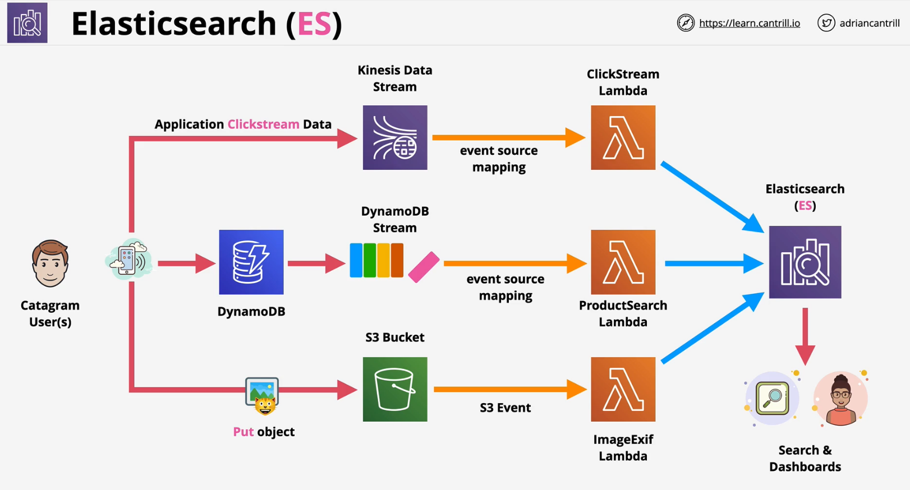

### Overview
- Managed implementation of **Elasticsearch**
- **ELK** - ES, Kibana and Logstash
- It is not serverless .. it runs in a VPC using compute
- Log analytics, monitoring, security analytics, full text search and indexing, clickstream analytics
  
### ELK
- **Elasticsearch** - Search and Indexing
- **Kibana** - visualisation/ dashboards
- **Logstash** - similar to CWLogs, needs a Logstash agent installed on anything to `ingest` the data
  

