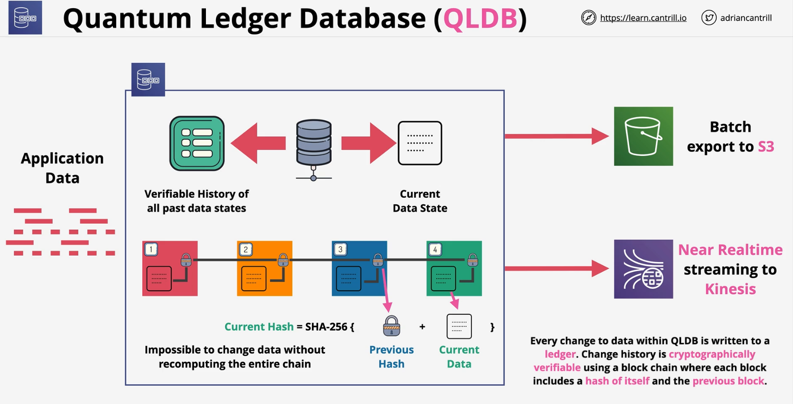

### Overview
Amazon QLDB is a fully managed ledger database that provides a transparent, immutable, and cryptographically verifiable transaction log owned by a central trusted authority

- **Immutable append-only** ledger based database
- **Cryptographically verfiable** transaction log
- **Transparent** - full history is always accessible
- **Serverless** - Provides Ledge and Tables - not servers
- **3AZ resilience** and replication **within each AZ**
- Can **stream** data to **Amazon Kinesis**
- **Document** DB Model
- **ACID** - Transfer A->B .. either **both** work or **none** work

### Use cases
- **Finance** - account balances & transactions
- **Medical** - full history of data changed
- **Logistics** - track movement of objects
- **Legal** - track usage and change of data(custody)

 

