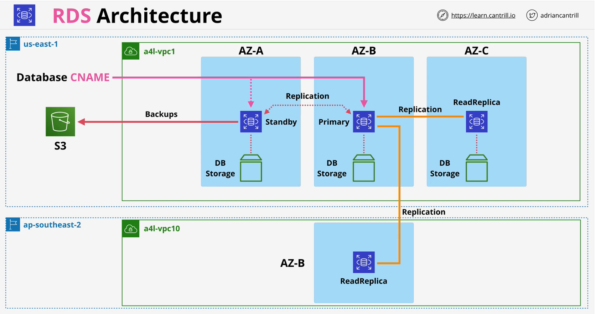
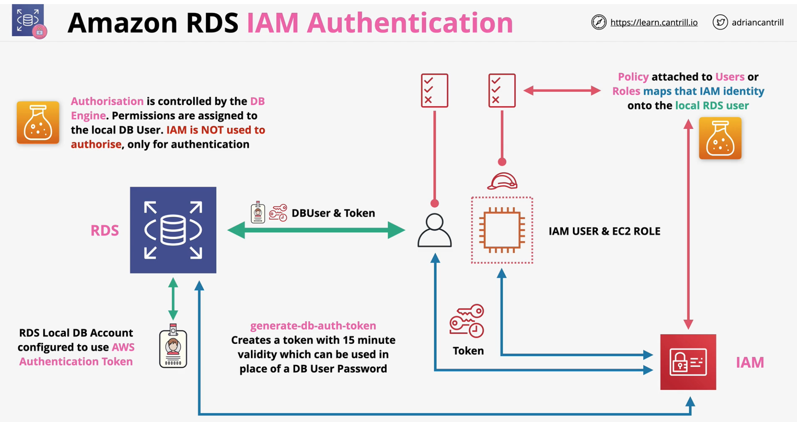

### Overview

- **Database Server** as a service
- **Managed Database** Instances ( 1+ databases)
- Supported DB Engines:
    - **MySQL**
    - **MariaDB**
    - **PostgresSQL**
    - **Oracle**
    - **Microsoft SQL Server**

**RDS Database Instance**
  
- DB Engine
    - **instances** like  `db.m5`, `db.r5`, `db.t3` =>  cpu and memory for each db type
- Database *Cname* 
- Single or Multiple AZ
- EBS backed volume
- Security groups to control access to the RDS

### Multi-AZ

- **Extra cost** for replicas - NOT FREE TIER
    - Synchronize replciation with standby instance
- Standby cannot be directly accessed
- **60-120s** failover - brief interruption
- **Same region only** (other AZs in the VPC)
- Backups taken **from Standby** (removes performance impact)
- Failvoer events - AZ outage, primary failure, manual failover, instance type change and software patching
  
### RDS Backups and Restores

- **Manual Snapshots** and **Automatic Backups**
    - AWS managed S3 buckets
    - S3 buckets are regional resilience
- Manual snapshots are performed manually and live past the termination of RDS
- Snapshots from either primary or standby (mult-AZ)
    - First Snap is **FULL** 
    - Then onward = **Incremental**
- **Backup windows** - could impact performance
- Automatic backups can be taken for an RDS instance with **0 (disabled) 35 Day retention**
    - only last within the lifecycle of the RDS
    - a final snapshot can be created before deleting the RDS  
- Automatic backups also use **S3 for storing transaction logs every 5 minutes** - allowing for **point in time recovery**.
    - Logs can be replayed on top of snapshots to restore RDS in point in time
- Snapshots can be restored .. but create a new RDS instance.

### RDS Read Replicas
- **Asynchronous replications**
- **Performance Improvements**
    - 5X direct read-replicas per DB instance
    - Each provide an **additional instance of read performance**
    - Replicas also can have replicas - data lgging issue
    - **Global** performance improvements - cross region replicas
- **Availability Performance**
    - Snapshots and backups improve RPO
    - RR's can be **promoted quickly** if the primary instance fails - **low RTO**
- data corruption is not handled - corrupted data is also replicated

### RDS Security
- **SSL/TLS** - in transit
- **EBS Volume** encryption - **KMS** 
    - Handled by Host/EBS
- AWS or Customer Managed CMK generates **data keys**
    - **Data keys** used for **encryption operations**
- Storage, Logs, Snapshots & replicas are encrypted
    - encryption can't be removed

- MSSQL and Oracle support TDE (Transparent Data Encryption)
    - Encryption handled within the **DB Engine**
- RDS **Oracle** supports integration with **CloudHSM**
    - CloudHSM is much stronger

#### RDS IAM Authentication
- Not AUTHORIZATION
  
