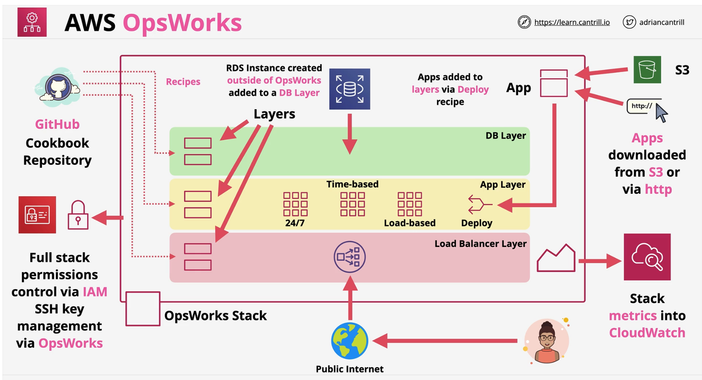

## AWS OpsWorks
AWS OpsWorks provides managed implementations of Puppet and Chef in a product which integrates with other AWS Products and services.

- **3 Modes**
    - **Puppet Enterprise** - AWS Managed Puppet Master Server
        - desired state of the infra
    - **Chef Automate** - AWS Managed Chef Servers
        - infra as code with ruby
    - **Opsworks** - AWS Integrated Chef, No Servers
- Use when you already have one of them 
- Requirement to automate... (suitable for infra engineer)
- Key terms to lookout for => **Recipes, Cookbook or Manifests**

### Terms
- Stacks - Core Component : **container** of resources
- Layers - each layer is a **specific function** within a stack
- **Recipes & Cookbooks**
- Lifecycle Events - **Setup, Configure, Deploy, Undeploy and Shutdown**
- **Instances** - EC2/On-premise
    - 24/7
    - time-based
    - load-based
- **Apps**
---
