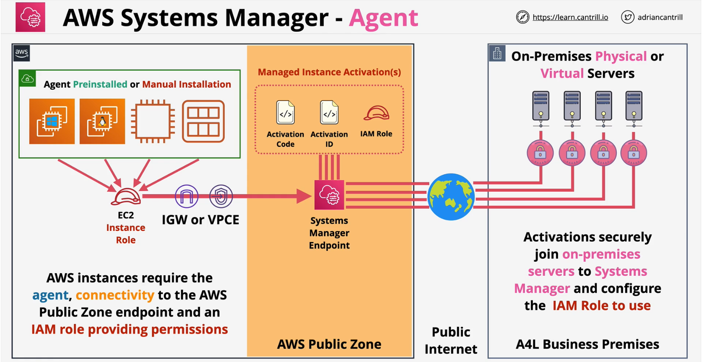
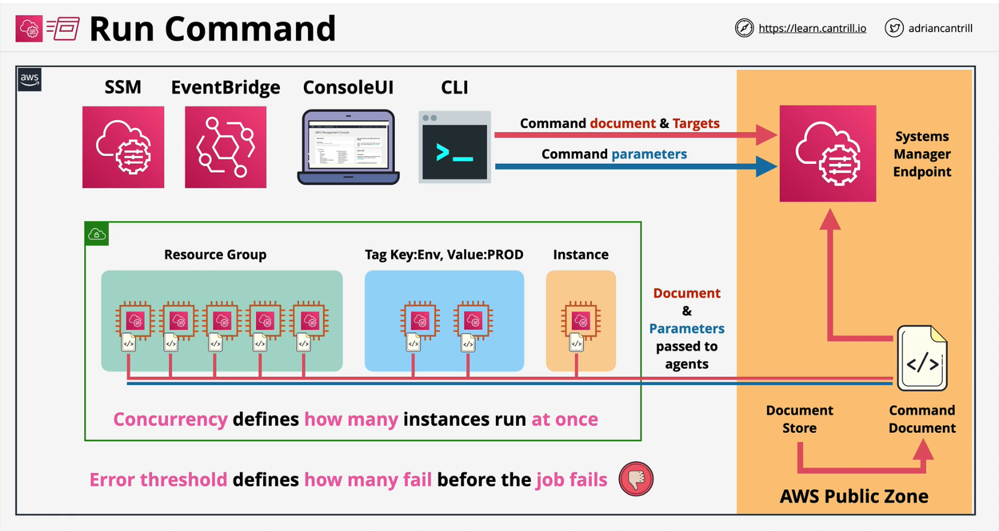
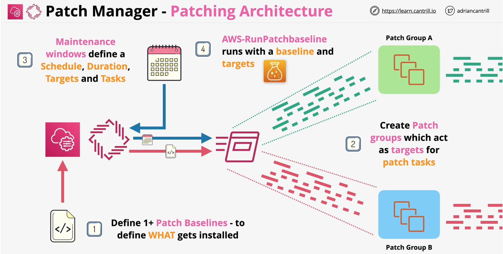

## AWS Systems Manager

### Agent
- **View** and **control AWS** and **on-premises** infrastructure
- **Agent based** - installed on **windows** and **Linux AWS** AMI's
- Manage **Inventory** & **Patch** Assets
- **Run commands** & Managed **Desired State**
- Parameter Store .. **configuration** and **secrets**
- Securely connect to EC2. even in private VPCs
---

### Run Command
Systems Manager **Run Command** is a foundational feature of Systems manager which allows for commands to be executed on **managed instances at scale**.

- [AWS Systems Manager documents](https://docs.aws.amazon.com/systems-manager/latest/userguide/sysman-ssm-docs.html)
- Run `command documents` on `managed instances` 
- No SSH/RDP Access Required
- **Instances**, **Tags** or **Resource Groups**
- **Command documents** can be reused and can have **parameters**
- Rate Control - **Concurrency** & **Error Threshold**
- Output Options - S3 and SNS
- Target of an **EventBridge rule**
---

### Patch Manager
Systems Manager **Patch Manager** allows for the patching of **windows or linux managed instances** running in **AWS or on-premises**.

**Concepts**
- Patch **Baseline**
- Patch **Groups**
- Maintenance **Windows**
- **Run Command**
- **Concurrency** & **Error Threshold**
- **Compliance**

**Patch Baseline**
- Predefined Patch Baselines - Various OS (you can also create your own)
- Linux - AWS-[**OS**]DefaultPatchBaseline, **expliitly define** patches
    - AWS-**AmazonLinux2**DefaultPatchBaseline
    - AWS-**Ubuntu**DefaultPatchBaseline
- Windows - **AWSDefaultPatchBaseline** - Critical and Security Updates
- **AWS-WindowsPredefinedPatchBaseline-OS** - same as above
- **AWS-WindowsPredefinedPatchBaseline-OS-Applications** - +MS App Updates

**Patch Manager**
- hybrid activations - generates activation code and id for on-premise isntances
- Patch Manager will pick the baseline of patch group if an insance is registered to a patch group else it will pick the default for the instance.

**Missing** 5 = Systems Manager inventory for checking the desired state of instances. 

