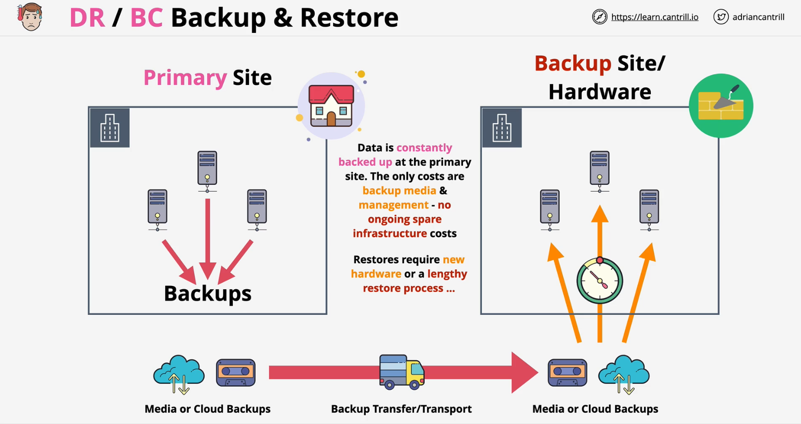
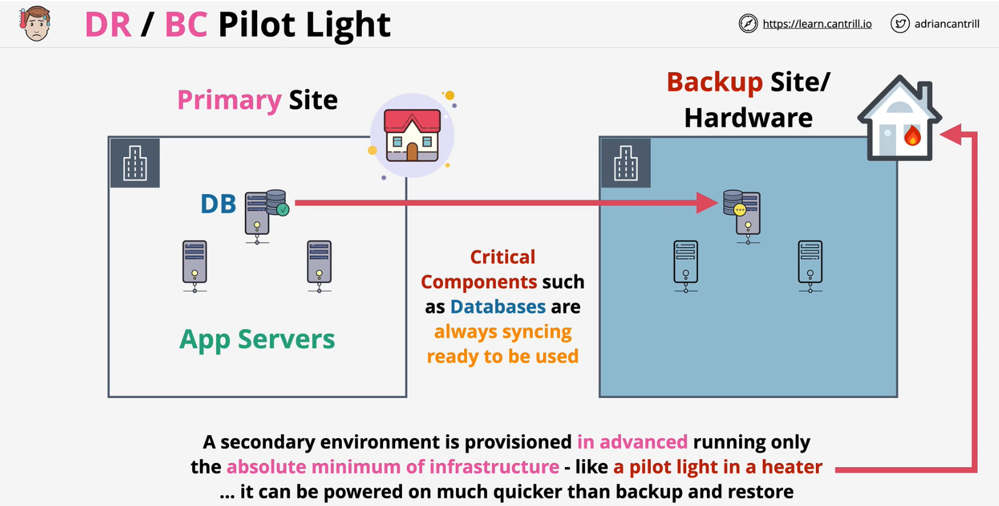
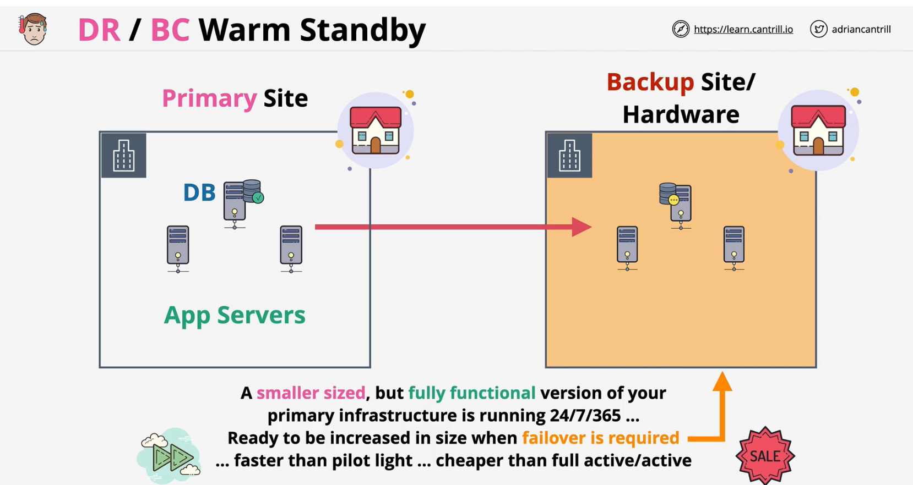
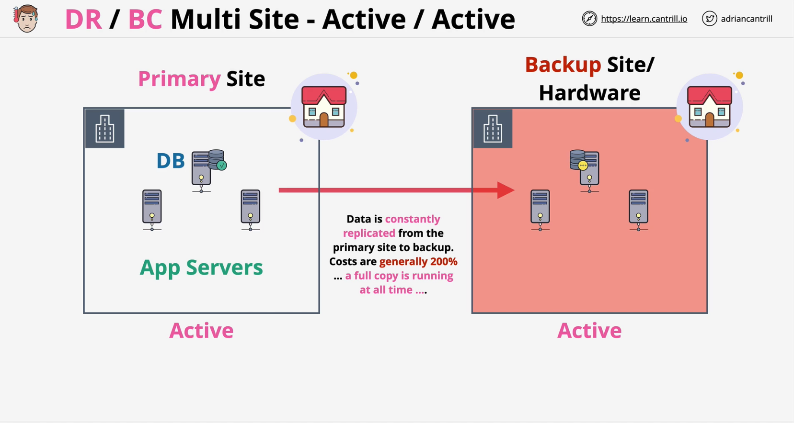

### Overview
- Efffective DR/BC **costs money** all of the time
- Need extra resource (backup or standby resources)
- Executing a DR/BC process **takes time**
- Cost Trade Off: Faster to Recover - more costilier

### Backup and Restore
- Have backups in place -- in an event of disaster restore them in different site/location
- Cost effective but will takes longer to restore in case disaster happens

 

### Pilot Light
- Secondary environment with bare minimum set up for faster recovery
    - auto sync data for Databases which are ready to use
    - provisioned but stopped instances

 

### Warm Standby
- Standby secondary site running the fully functional version of primary infra but with less resources and size.
    - cheaper instance type
    - lower no. of intances in ASG
    - can be upgraded/updated when failover is required
- Little costlier than pilot light (**cheaper than active/active**) but faster to recover in case of disaster

### Active/Active
- Have exact and fully functional version of primary infrastructure running in secondary site/location
- The most costliest (**200%**) set-up but does not require recovery during disaster event
- Since both sites run fully functional apps, they can be load balanced as well
    - provides better **performance** and improves **HA**

