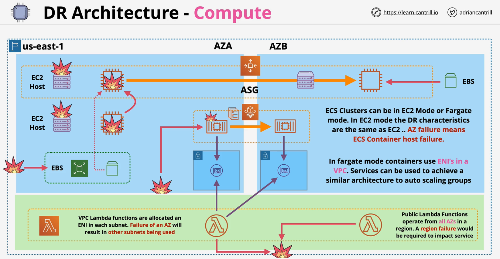

### Overview
NO truly global compute services in AWS

### EC2
- Always assume it can be shutdown or replaced
- EC2 host fails in one AZ
    - reattach EBS to new instance
    
- Run EC2 instances with ASG in multiple AZs
    - ASG will launch EC2 instances in case of instance failures

### ECS
- EC2 mode or Fargate mode
- EC2 mode
    - underlying ec2 instances fails -> containers fail
    - underlying ec2 can be run in ASG with multiple AZ to tolerate AZ failure
- Fargate mode
    - underlying ec2s managed by AWS fails -> containers fail
    - spread the containers across multiple AZ with configuration

### Lambda
- Stateless
- VPC lambda function 
    - ENIs per subnet in the VPC to launch in any subnets
- Public lambda function
    - can be launched from any AZs

- Lambda Service is impacted when there is a region failure