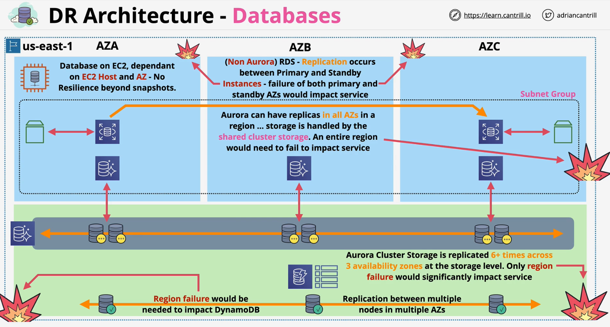
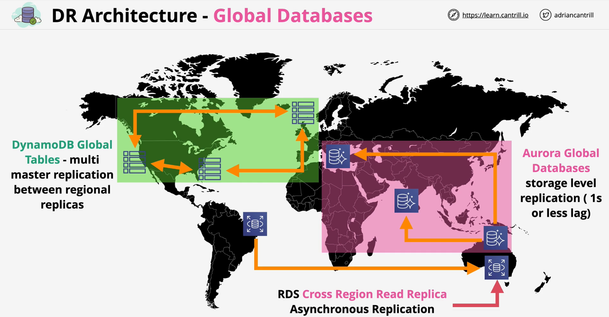

## Regional
### Overview

### DB running in EC2
- Running DB in EC2 instances will not provide HA or resiliency
    - EC2 and EBS - single AZ product by themselves

### RDS
- Runs in subnet group which spans over mutliple AZs
- Primary instance with standby instance in different AZ
    - Synchcronous replication between primary and standby instances
    - Failover happens when primary instance goes down and standy becomes primary
- Both primary and standby has to be down from multi-AZ failure to cause complete failure in the region

### Aurora
- Can handle multi AZ failures
- Volume(virtual database storage) runs in cluster mode which spans multiple AZ
- Both primary (also write) and replicas read from same cluster volume
    - upto 15 read-only replicas
    - failover process is automated if primary instance goes down
- Only region failover would significantly impact service

### DynamodDB
- Replcations between multiple nodes in mutliple AZs
- Fails when the region goes down

## Global

### Overview

### DynamoDB Global Tables
- Default dynamoDB table located in single region
- Global Table provides multi master replications between regional replicas
    - last write wins replication method
- Same region write - strongly consistent read | Alternate region - eventual consistency read

### Aurora Global Databases
- Read/Write cluster in one region and Read cluster in different regions
    - read cluster can be promoted to read/write cluster 
- Storage level replication - 1s lag
- **NON multi master**

### RDS cross-region replication
- Cross Region Read Replica
- Asynchronous Replication - lag could be longer compared to aurora