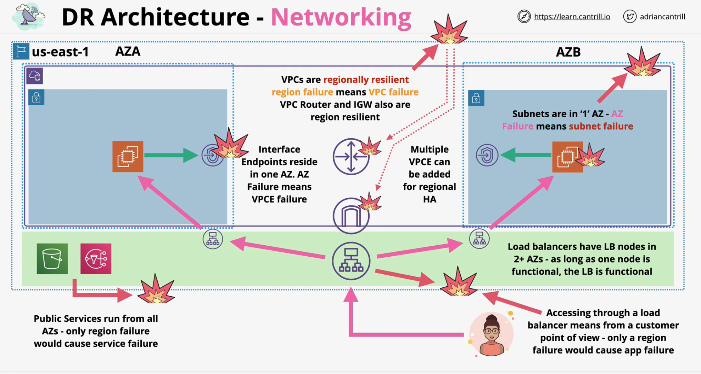

## Regional
> Public services like **SNS** and **S3** operate from all AZs - only region failure would cause service failure

### VPC
- VPC - **regionallly resilient** along with IGW and VPC Router
    - can withstand AZ failure
    - only fails when region fails
- Subnet - **AZ failure** will also cause **subnet failure**
    - nat gateway fails when AZ fails
- Interface Endpoint - **AZ failure** will also cause **interface endpoint failure**
    - deploy multiple VPCE for regional HA

### Load Balancer
- Consists of LB nodes in 2+ AZs - regionally resilient
    - as long as one node is functional, LB is functional
- Can withstand AZ failure
    - only fails when entire region fails

## Global Network
### Route53
- Global Service
- Route53 to point to services in mulitple regions provide global discoverability and resilience
    - configuration to not route to unhealhty region (regional health check)

