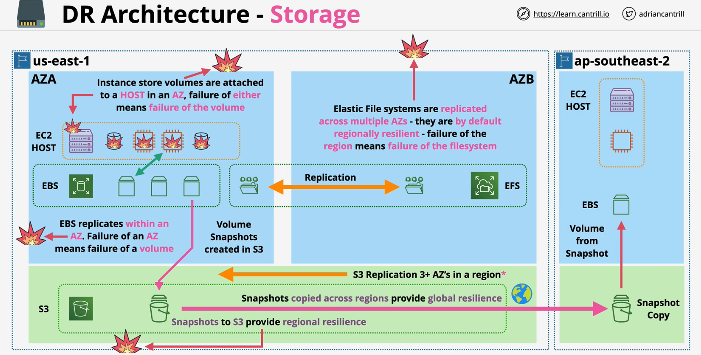

### Overview

### Instance Store Volumes
- Attached with EC2 and no recovery in case of failure - temporary solution
- Fails when .. 
    - hardware fails
    - AZ fails
    - EC2 host fails

### EBS - Elastic Block Storage
- Runs in one AZ 
- No replication of data from one AZ to another
- Fails when ..
    -  AZ fails
- Snapshots of EBS volume can be stored in S3
    - but those snapshots can be used directly
    - restore by creating new volume in different AZ if required

### S3
- Replication runs in 3 AZs
    - One Zone storage class does not replicate beyond one AZ but cheaper

- Snapshots stored in s3 gets regional resilience 
- Snapshots shared and copy across multiple S3 buckets across multiple regions
    - Cross-Region Replication

### EFS - Elastic File System
- Replicated accross multiple AZs
- mounted to Linux ec2
- Fails when..
    - Region fails

