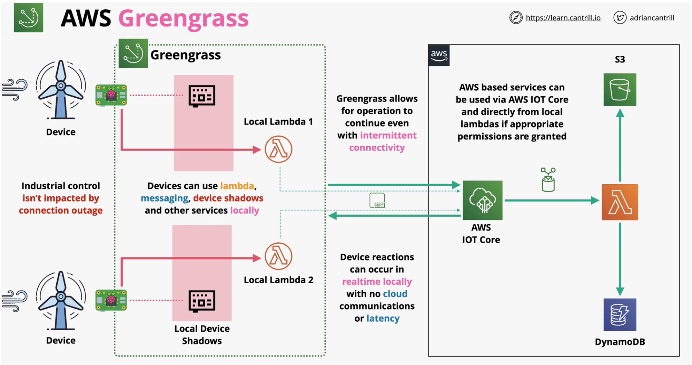

### AWS Greengrass
- Extends some AWS services to the edge
- Some compute, messaging, data management, sync and ML capabilities
- Locally run lambdas
- Locally run containers
- IOT Device Shadows locally - synced back to AWS
- Local messaging - MQTT
- Local hardware access for Lambda

AWS IoT Greengrass makes it possible for customers to build IoT devices and application logic. Specifically, AWS IoT Greengrass provides cloud-based management of application logic that runs on devices. **Locally deployed Lambda functions and connectors are triggered by local events, messages from the cloud, or other sources**.

In AWS IoT Greengrass, devices securely communicate on a **local network and exchange messages with each other without having to connect to the cloud**. AWS IoT Greengrass provides a **local pub/sub message manager that can intelligently buffer messages if connectivity is lost** so that inbound and outbound messages to the cloud are preserved.

 

