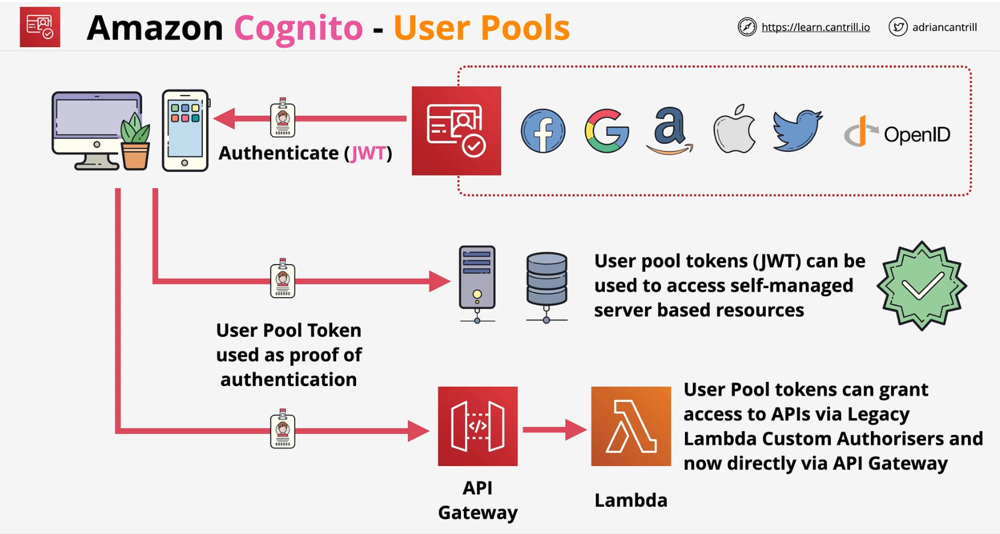
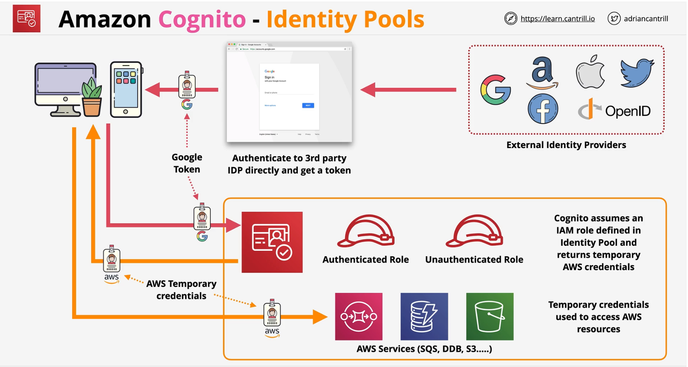
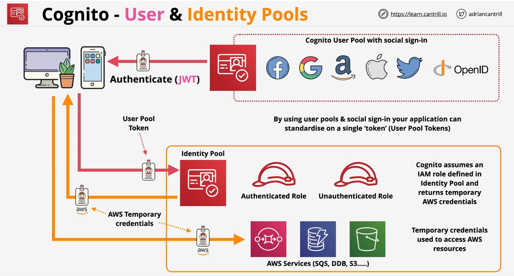

### Overview

- **Authentication**, **Authorization**, and **user management** for web/mobile apps
- **USER POOLS** 
    - **SIGN-IN** and get a JSON Web Token (**JWT**)
    - Provides user directory management and profiles
    - Sign-up and sign-in (customisable web UI), MFA and other security features

 

- **IDENTITY POOLS**
    - Allow you to offer access to **Temporary AWS Credentials**
    - Unauthenticated identities - Guest Users
    - Federated Identities - **SWAP** - Facebook, Google, Twitter, SAML2.0 & User Pool for short term AWS Credentials to access AWS Resources

 

### User Pools + Identity Pools
