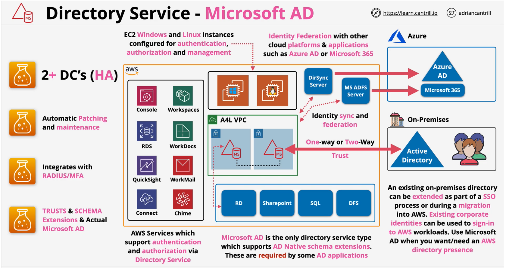
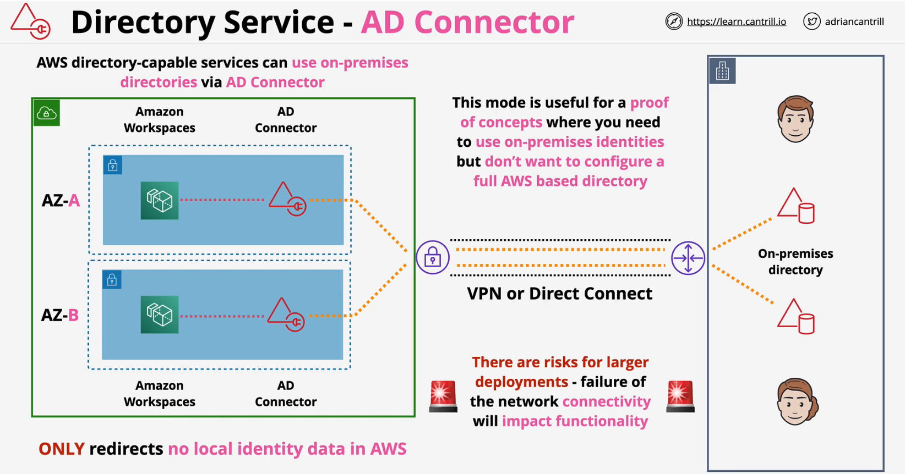

### Microsoft AD
- Built using **Microsoft Active Directory** 2012 R2
- Managed using **Standard Active Directory tools**
- Supports **Group Policy** and single-sign-on(SSO)
- Supports **Schema extension** - MS AD Aware Apps
    - **Sharepoint**, **SQL**, Distributed File System (**DFS**)
- **Two sizes** - **Standard** (30,000) & **Enterprise** (500, 000)
- Used for AD **Authentication/Authorisation** of products and services within AWS
- Highly-Available by default(**2AZ+**) - domain controller in each AZ
- Fully managed by AWS: including **monitoring, recovery, replication, snapshots and maintenance** - configurable

- Supports **one-way** and **two-way external** and **forest trust** with on-premises active directory
- Directory in AWS - can operate through a network link failure to any connected on-premises systems
- Supports **Raduis-based MFA**
- Best choice for **more than 5000 users** and if you need **trust relationships** between AWS and your **on-premises** directories

 

### AD Connector
- A **pair** of directory endpoints *runnig in AWS** (**ENIs** in a **VPC**)
- Supports directory-aware AWS products
- **Redirects requests** to **existing directory servers**
- No directory data stored in AWS .. **all redirected**
- Use **existing on-premises AD** with **directory compatible AWS services** - without any identity data in AWS
- **Proof of concepts**, where you need to use existing identities.
- Two sizes.. **small** and **large** ..  no explicit limits
    - controls the amount of compute allocated

- Multiple AD connectors can be used to spread load
- Requires **2 subnets** within a VPC .. **different AZs**
- Connector requires 1 or more directory server(s) to be configured
- **REQUIRES** a  working network connections
- Network connectivity via **Direct Connect** or **VPN**

 

