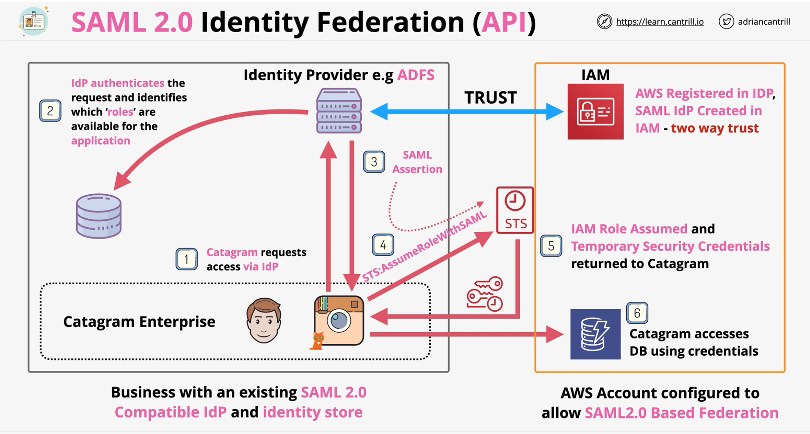
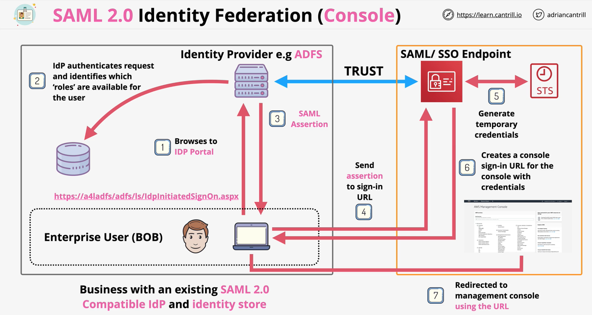

### Overview
- Process of using identify from another identity provider to acess AWS resources

- SAML - Security Assertion Markup Language
- Open Standard  used by many ldP's (e.g. **MS ADFS**)
- **Indirectly**  use on-premises IDs with AWS (console & cli)
- **Enterprise Identity Provider** - **SAML 2.0** Compatible
    - NOT google, facebook, twitter and web
- For **existing identity management team**, levarage this
- **More than 5000 users** and single source of truth
    - leverage ID provider
- Federation within AWS uses **IAM roles and temp creds(upto 12 hours)**

 

