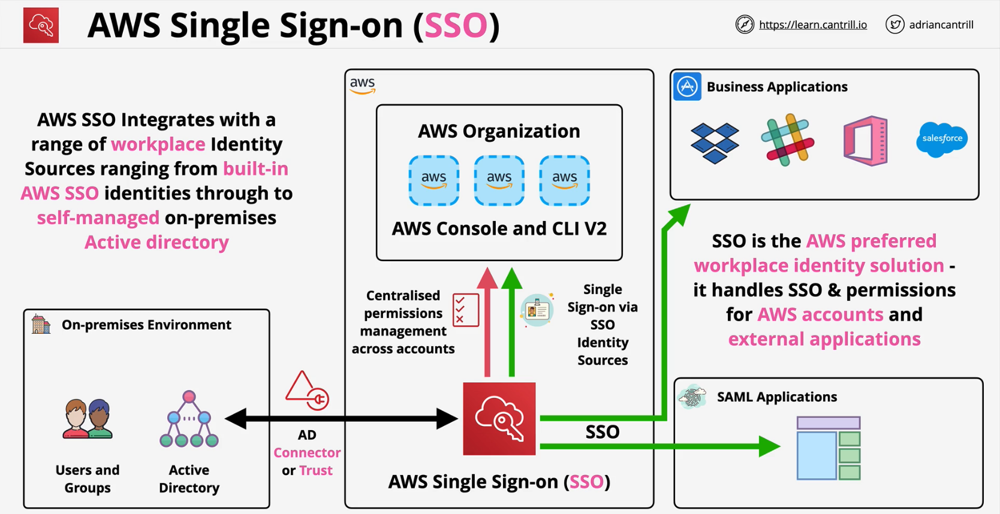
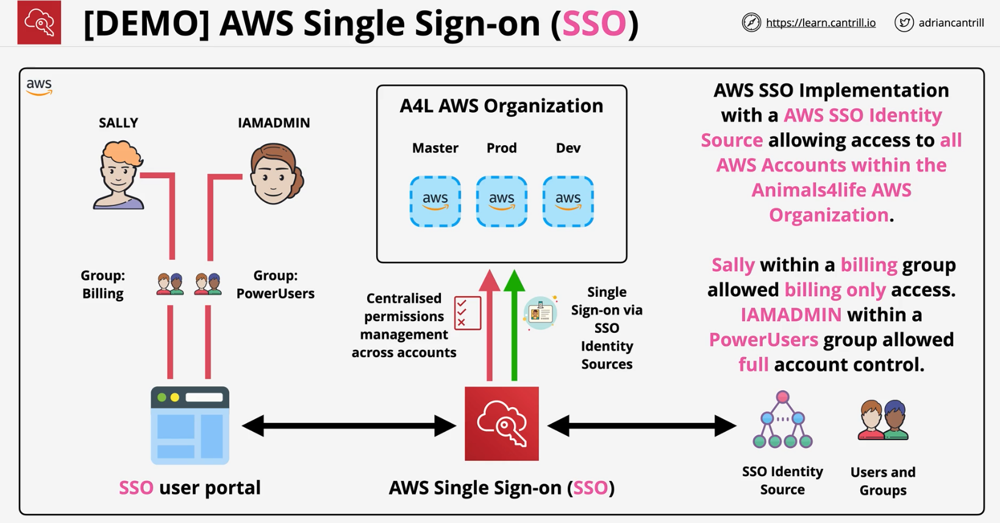

### Overview
- Recommended for any new identity federation
- Manage SSO Access - **AWS Accounts** and **External Applications**
- Flexible **Identity Source**
- AWS SSO - **Built-in identity Store**
- AWS Managed Microsoft AD
- On-premises Microsoft AD (**Two way trust** or **AD Connector**)
- External Identity Provider - **SAML 2.0**
- **Preffered by AWS** vs traditional `workforce` identity federation

- SSO is the **AWS perferrred workplace identity solution
    - also handles SSO and permissions for **AWS accounts** and **external applications**
    - NOT web or customer identity
- **NO** associated Cost
 

### Demo
- Source of Identity Provider - could be default SSO built-in idenitty provider
- User portal
    - log into the get the list of all the AWS accounts that user have access to
        - both console an API
- MFA for users - user can register and manage their own MFA devices
- Permission sets to define permissions
    - session duration (by default 1 hour --- 12 hour)
    - users 
    - groups + permission set -- assigned them to the AWS accounts in the organization

 

