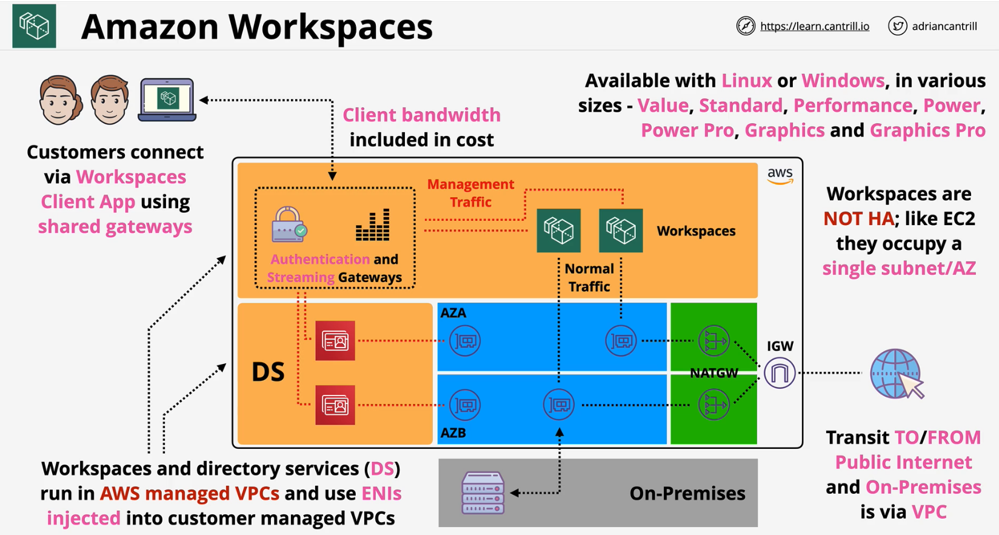

### Overview
- Desktop-As-A-service (**DAAS**) - Home-working/Office
- Similar to **Citrix/Remote Desktop** - Hosted by AWS
- **Consistent desktop** from **anywhere** - **apps** and **state**
- **Windows** & **Linux** - **Various Sizes**
- With or without AWS provided Apps & Custom Images
- **Monthly** or **Hourly** pricing (+base infrastructure cost)
- Uses **Directory Service** for authentication and user management  
    - AWS Managed Microsoft AD
    - Simple AD - **Samba 4 Active Directory Compatible Server**
    - AD Connector
- Workspaces use an **ENI** in a VPC .. **use VPC networking**
- Windows - Access **FSx** and **EC2** windows resources
    - or on-premises resources over **VPN** or **Direct Connect**
- Provides (system + user) volume and at-rest encryption (**EBS + KMS**)

- NOT HA - in single subnet

### AWS AppStream 2.0
- Does not support Simple AD

Amazon AppStream 2.0 is a fully managed non-persistent desktop and application service for remotely accessing your work.

