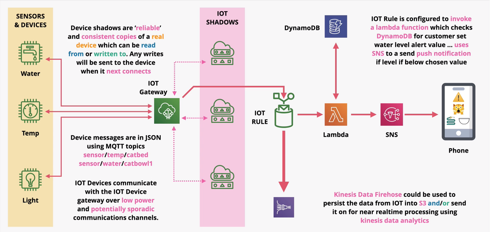

### IOT (internet of things)
- AWS IOT core is a suite of products
- Used for managing 1,000,000s of IOT devices
    - temp, wind, water sensors, lights, valve control..
- Provisioning, updates and controls of IOT devices
- Unreliable links -- device shadows
- Rules and event-driven integration with AWS services

