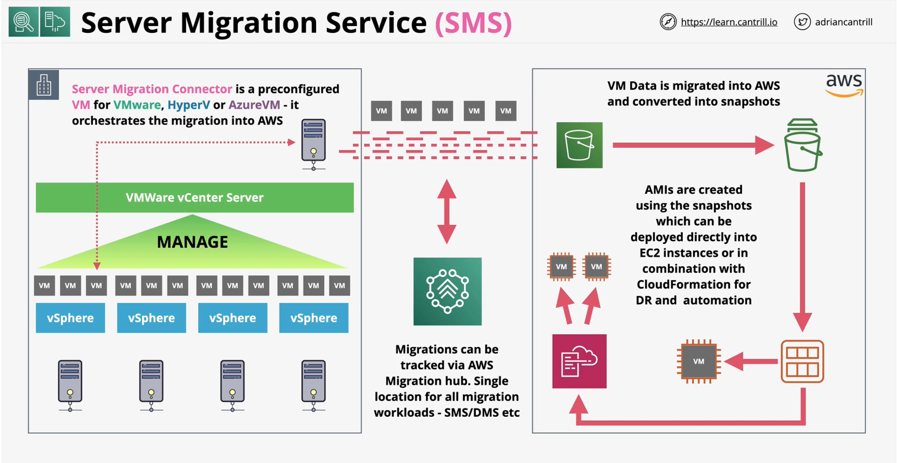

#### Applicaiton Discovery Service
- **Discover** on-premises **infrastructure**
    - vms, cpu, memory including utilization
- Different modes:
    - **Agentless** (Application Discovery Agentless Connector)
        - ...OVA appliance, integrates with VMWARE - inventory, vm usage
        - measure **performance** and **resource usage** - limited to metrics that has been exposed externally

    - **Agent Based** discovery for `in VM` data gathering.
        - network, processes, usage, performance
        - more detailed metrics and informations
        - ..**dependancies** between servers (network activity)

- Integration with **AWS Migraiton Hub** and Amazon **Athena**
    - hub - tracks migration of different types within AWS
    - athena - perform adhoc analysis of data generation

#### Server Migration Service (SMS)
https://docs.aws.amazon.com/server-migration-service/latest/userguide/server-migration.html

**AWS Server Migration Service (SMS)** is an **agentless service** which makes it easier and faster for you to migrate thousands of **on-premises workloads** to AWS. AWS SMS allows you to **automate, schedule, and track incremental replications of live server volumes**, making it easier for you to coordinate large-scale server migrations.

- Migrate whole VM's (OS, Data, Apps .. migrated as is) 
- Runs on **Agentless** mode - **connector** runs as VM on-premise
- Integrates with VMWare, Hyper-V and AzureVM only
- Import/Export (anothe AWS service) - downtime
- **Incremental** replication of **live volumes**
- **Orchestrate** multi-server **migrations**
- Creates **AMIs** which can be used to create EC2 instances
- Integrates with **AWS Migration Hub**

