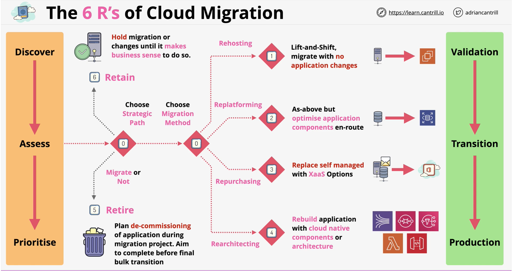

#### 6 R's of Cloud Migration
https://aws.amazon.com/blogs/enterprise-strategy/6-strategies-for-migrating-applications-to-the-cloud/
#### Rehosting - Lift and Shift
- Migrate as it is (App Virtual Machine - EC2, DB => EC2)
- +Reduced **Admin Overhead** (IAAS)
- +Potentially easier to optmise when in AWS
- **Cost savings** -- burst instances
- not taking full advantage of cloud
- kicking the can down the road
- **VM Import/Export & Server Migration Service**

#### Replatforming - Lift and Shift with Optimization
- like rehosting but with **Optimization**
- using **RDS** instead of **self-managed DBs**
- using **ELB** instead of **load balancers**
- using **S3** as **backup** or **media storage**
- **no real negatives** & **no world-changing benefits**
- **Admin Overhead** Reductions, **Performance** Benefits, more **effective backups** or Improved **HA/FT** - *high availability & fault tolreant*

#### Repurchasing - Move to something new.. SAAS
- when there is no reason to **self-manage**
    - USE a **XaaS** Product
- **Example**
    - MS Exchange **=>** Microsoft 365
    - CRM **=>** Salesforce
    - Payroll **=>** Xero

#### **Refactoring/ Re-architecting** - Take advantage of cloud
- **reviewing** the **architecture** of an application
- adopting **cloud-native** architectures & products
- **Service-Orientated** or **Microservices**
- **APIs, Event-Driven or Serverless**
- Initially very expensive & time consuming
- best **long-term benefits**
    - often **cheaper**
    - much more **scalable** 
    - better **HA/FT**
    - **costs aligned** with app **usage**

#### **Retire** - Do we even need this ? NO? Dump it
-  Systems are often running for no reason 
- **Auditing** their usage is often **more work** than **leaving running**
- If you dont need the application -->  switch if off

#### **Retain** - Not worth time/money or is too scary to migrate
- DO NOTHING
- **Old Application** - not worth the move
- **Complex application** - leave till later
- **Super critical application** - risky
- Complete the migration - swing back to focus on the left-overs
---

