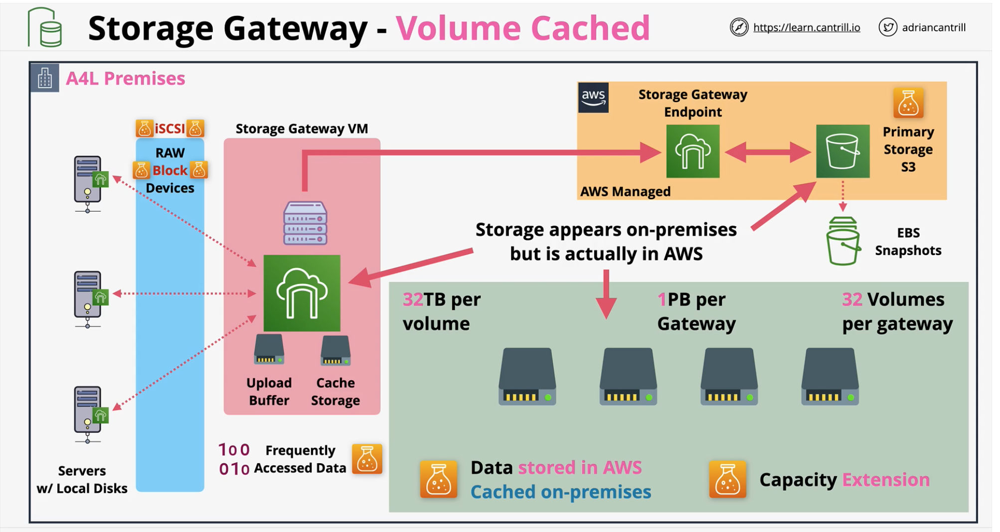
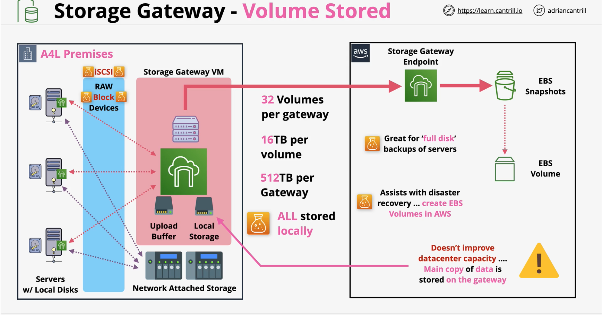
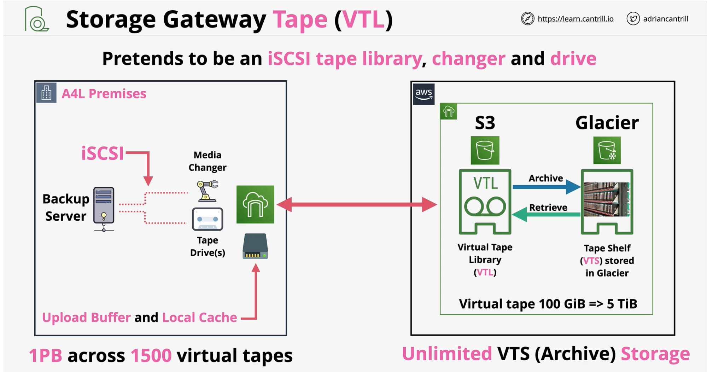

### Storage Gateway
[FAQS](https://aws.amazon.com/storagegateway/faqs/)

- **VM or the hardware appliance in on-premise**
- Supports protocols such as iSCSI, SMB, and NFS
- Integrates with **EBS, S3 and Glacier in AWS**
- Migrations, extensions, storage tiering, DR and replacment of backups
- **Use Cases**
    1. move backups and archives to the cloud
    2. reduce on-premises storage with cloud-backed file shares 
    3. provide on-premises applications low latency access to data stored in AWS 
    4. data lake access for pre and post processing workflows.

#### Volume Gateway

Volume Gateway provides **an iSCSI target**, which enables you to create block storage volumes and mount them as iSCSI devices from your on-premises or EC2 application servers. The Volume Gateway runs in either a cached or stored mode.

- In the **cached mode**, your primary data is written to S3, while retaining your frequently accessed data locally in a cache for low-latency access.

- In the **stored mode**, your primary data is stored locally and your entire dataset is available for low-latency access while asynchronously backed up to AWS.

#### Tape Gateway - VTL(virtual tape library) Mode

#### File Gateway
- Bridges on-premises **file storage** and **S3**
- Mount Points (shares) available via **NFS** and **SMB**
- Map directly onto an S3 bucket
- **Files stored** into a **mount point**, are **visible as objects** in a **S3 bucket**
- **READ** and **WRITE Caching** ensure **LAN-like** performance

The Amazon S3 File Gateway enables you to store and retrieve objects in Amazon S3 using file protocols such as Network File System (NFS) and Server Message Block (SMB). Objects written through S3 File Gateway can be directly accessed in S3.    

The Amazon FSx File Gateway enables you to store and retrieve files in Amazon FSx for Windows File Server using the SMB protocol. Files written through Amazon FSx File Gateway are directly accessible in Amazon FSx for Windows File Server.