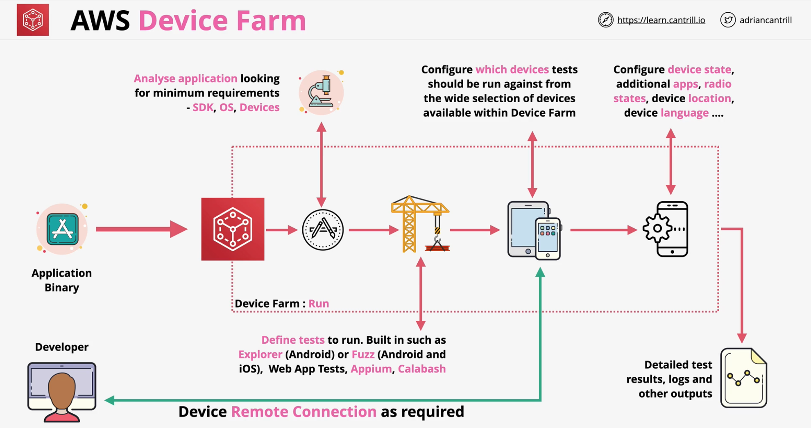

### Overview
- Provides managed **Web** and **Mobile Application** testing
- Test on a *fleet* of **real browsers** and **devices**
- Real devices
    - **Phones, tablets, different languages, sizes and operatings systems**
- Use **built in** or **supported automated testing framework**
- Receive reports detailing testing output

 

 