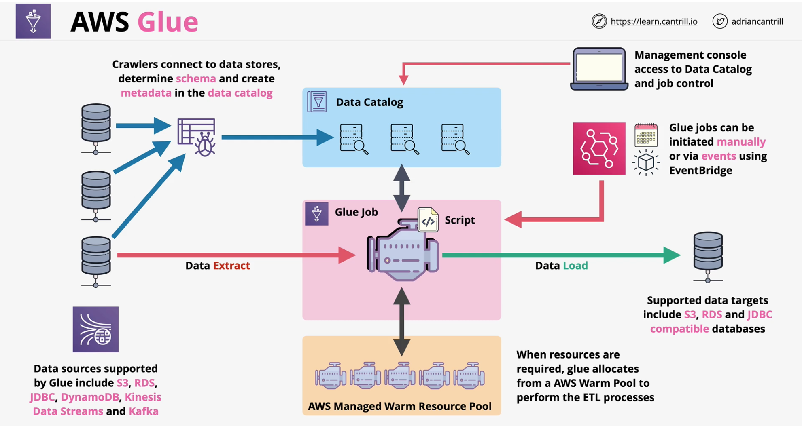

### Overview
- Serverless ETL (Extract, Transform & Load)  service
    - different than **datapipeline** (which can do ETL) and uses servers (**EMR**)
- **Moves** and **Transforms** data between **source** and **destination**
    - use glue job to enrich data in serverless way
- **Crawls** data sources and generates the **AWS Glue Data Catalog**
- Data **Source:Store** - S3, RDS, JDBC compatible & DynamoDB
- Data **Source:Streams** - Kinesis Data Stream & Apache Kafka
- Data **Targets** - S3, RDS, JDBC Databases

### AWS Glue - Data Catalog
- **Persistent metadata** about data sources within a region
- **One catalog** per **region** per **account**
    - Avoids data silos.. 
- Amazon Athena, Redshift Spectrum, EMR & AWS Lake Formation all use Data Catalog
    - configure crawlers for data sources
- **Either AWS Glue or datapipeline**

 

