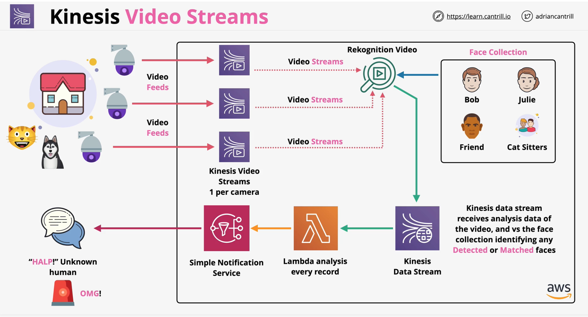

### Overview
- Ingest ingest live video from producers
- **Devices** like 
    - security cameras, smartphones, cars, drones
    - time-serialised audio, thermal and RADAR data
- Once data is ingested to AWS, consumers can access the data frame by frame .. **or as needed**
- Can **persist** and **encrypt** (both in rest and transit)
- cannot ingest data directly.. only via API
- Integrates with other AWS services like **Rekognition** and **Connect**

