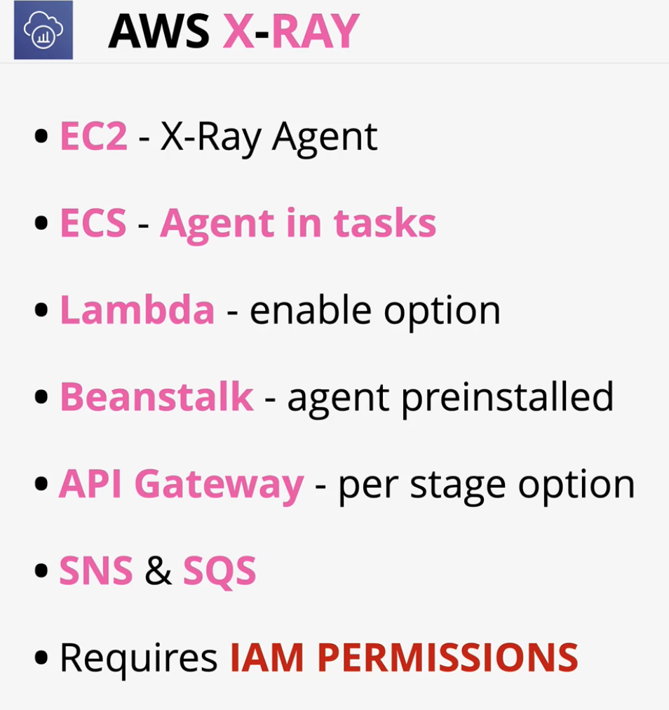

### Overview
- **Tracing Header** - **trace ID** is generated and tracked through out the distributed application for a given request
- **Segments** - Data blocks --> ip/host, response, work done(times), issues
- **Subsegments** - more granular vesion of segments including calls to other services as a part of the segment (endpoints etc)
- **Service Graph** - JSON Document detailing services and resources which make up your application
- **Service Map** - Visual version of the service graph showing traces

### Integration
