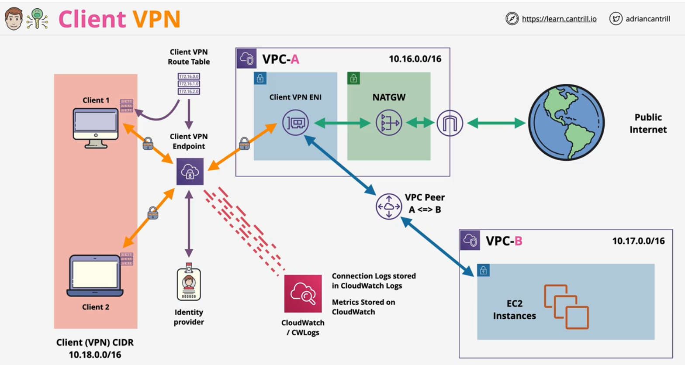
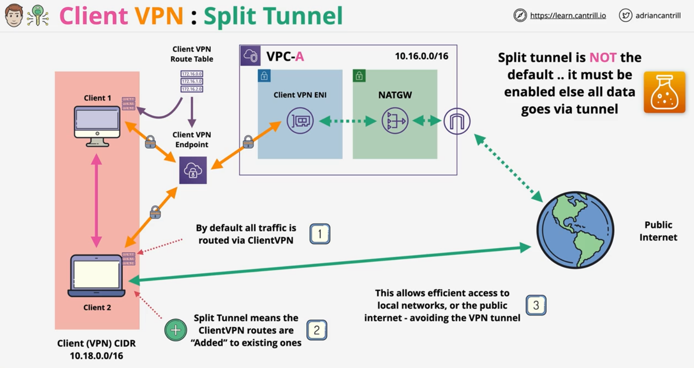

### Overview
- Managed implementation of **OpenVPN**
    - supoorts any client with OpenVPN software

- Client connects to a  **Client VPN Endpoint**
    - associated to **ONE VPC**
    - 1 + Target Networks for **high availaibility**
    - .. **billed** based on **network associations**

### **Client VPN Endpoint**
- **COST** - per interface deployed
- **Creates** interface (**Client VPN ENI**) in subnet (one subnet per AZ)
    - multiple subnet target association for HA
- **Authentication**
    - Certificates (imported to ACM)
    - Federated Identity provider
    - AWS directory service (Simple AD for demo)
- **Logging** - integates with cloudwatch logs
- **Client VPN Route Table** - pushed to client machine 
- **Split Tunnel** - Instead of replacing client route table, routes are added to the existing route tables
        - split tunnel is not default and should be enabled while creating client VPN endpoint
- Client - **AWS VPN Client** - with `.ovpn` file from VPN endpoint
    
 

