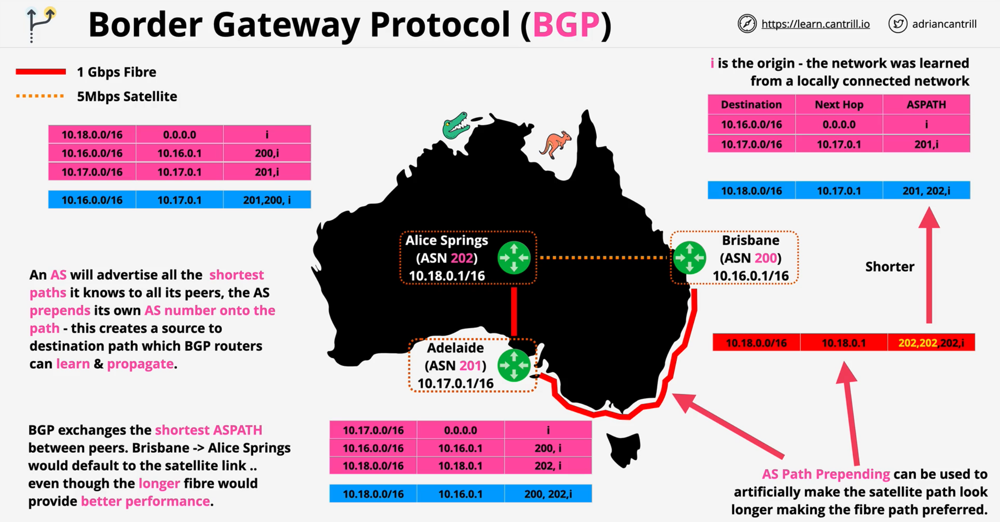

### Overview
- Autonomous System (**AS**) - self managing network
- **BGP** comprises of **ASs** and viewed as black box
- Autonomous System Number(**ASN**) are unique and allocated by [IANA](https://www.iana.org/numbers) (**0-65535**), **64512-65534** are private
- **Distributed and Reliable** and operates over **tcp/179**
- Peering between two AS is not automatic
    - **peering is manually configured**
- **iBGP** = Internal BGP - Routing **within** an AS
- **eBGP** = ExternalBGP - Routign **between** AS's

### BGP path traversal

BGP is a **path-vector** protocol

- exchanges the **best path** to a **destination** between **peers**
- the path is called **ASPATH**
- **does not consider link speed or condition** while calculating and advertising shortest path to its peers
- **Prepending same ASN no. to the ASPATH** can be used to artifically make a path longer making the other path preferred (if needed).

