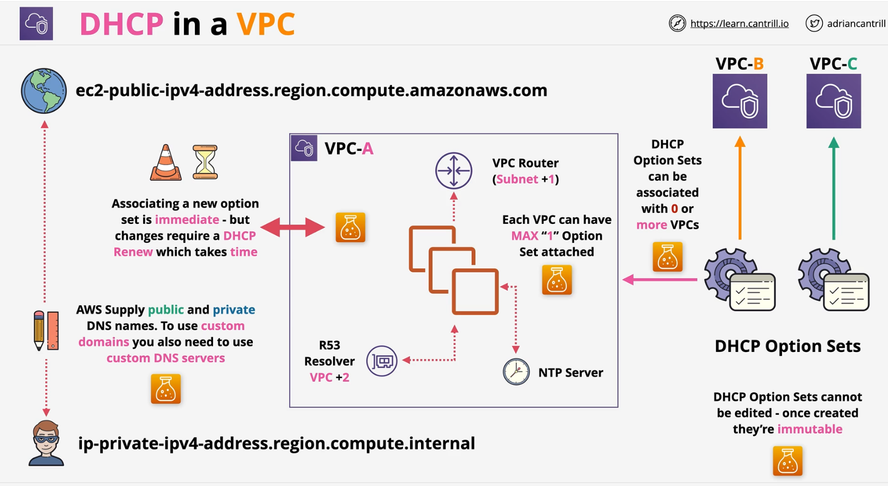

### DHCP in a VPC

The **Dynamic Host Configuration Protocol** (DHCP) provides a standard for passing configuration information to hosts on a TCP/IP network. The options field of a DHCP message contains configuration parameters, including the `domain name`, `domain name server`, and the `netbios-node-type`.

When you create a **VPC**, **AWS automatically** create a **set of DHCP options** and **associate them with the VPC**. You can configure your **own DHCP options set**for your VPC.

- Once created, **DHCP** option sets cannot be modified IMMMUTABLE
- DHCP option sets can be associated with 0 or more VPCs
- One VPC can have only 1 max Option Set
- Associating a new option set is immediate - but changes require a DHCP Renwe which takes time
- Default Gateway - subnet + 1
- DNS Server - VPC + 2 (by default R53 Resolver)

