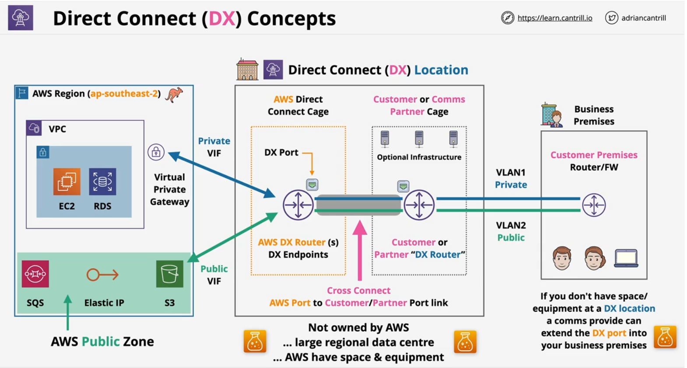
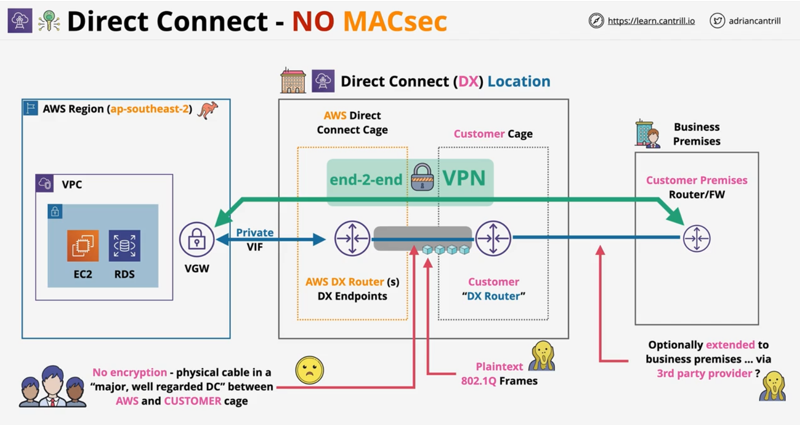
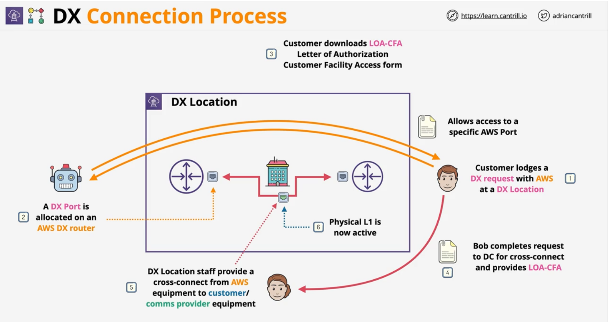
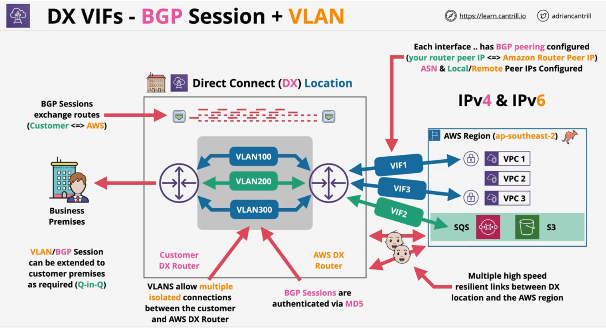

### DX Concepts
- A physical connection **(1, 10 or 100 Gbps)**
- Business Permises => DX Location => AWS Region
- **Port Allocation** at a **DX Location**
    - hourly cost
    - outbound data transfer

- **Provisioning time** - AWS take time to allocate the port
- Once the **port is allocated**, customer will need to arrange connection into the port
    - could take weeks or months to seting up connection intially - like physically laying the cables bettween business permises and DX Location
    - physical cable does not provide resilience

-  **DX** provides **low & consitent latency** + **high speeds**
- Can access AWS **Private** Services (**VPCs**) and AWS **Public** Services - NO INTERNET

- Within the **DX** location, a **Cross Connect** is established between **AWS DX Router** and **Customer DX Router**.
- **AWS DX Rotuer** and **Customer DX Router** resides in **AWS Direct Connect Cage** and **Customer/Comms Cage** respectively.
- Configure Virtual Interfaces over physical cables - VIFs

### DX Physical Connection Architecture
- DX Connection = **Physical Port** (1, 10, 100 Gbps)
- Can only use **Single-mode fibre** and  NO  copper

    | Speed| Transceiver|
    |:---:|:---:|
    |1Gbps| **1000BBASE-LX** (1310 nm) Transceiver|
    |10Gbps| **10GBBASE-LR** (1310 nm) Transceiver|
    |100Gbps| **100GBASE-LR4** |

- Auto-Negation shoule be DISABLED
    - configure **port speed** and **full-duplex** manually set

- Ensure the **router** in **DX location** supports **BGP** and **BGP MD5** Authentication
    - optional: **MACsec** and Bidirectional Forwarding Detection (BFD)

> VPC endpoints cannot be accesed through Private VIP (don't need them) - accessible through public VIP

### DX Security (MACSec)
MAC Security (MACsec) is an IEEE standard that provides data confidentiality, data integrity, and data origin authenticity.

- Frame **encryption** - **layer 2** - IEE 802.1AE-201188
- **Hop by Hop** encryption between two switches/routers (adjacency)
- **Confidentaility** - strong encryption
- **Data Integrity** - data cannot be modified in transit
- **Data oriign authenticity**
- **Replay Protection** 
- Does not **replace IPSec over DX** - not end-2-end
- Designed to allow for super high spped .. terabit networks 

#### MACSec - 101
- Each MACSec participant creates **secure channel** - unidirectional (1 IN an 1 OUT)
    - Secure Channel Identifier (**SCI**)
- **Secure Associations** - **sessions** on SC, generally **1** exists at a time
    - series of transient sessions
    - **1 exists** at a time except when they are being **replaced**

- MACsec encapsulation - 16 bytes **MACsec tag** & 16 bytes Integrity Check Value (**ICV**)

- MACsec Key Agreement - **discovery, authentication & key generation**
- Cipher Suite - **how** data is **encrypted** .. packets per key, rotation ...

[Get started with MACsec on dedicated connetions](https://docs.aws.amazon.com/directconnect/latest/UserGuide/direct-connect-mac-sec-getting-started.html)

 

### DX Connection process

- A DX connection begins in a **DX location**
    - contains contains **AWS** equipment
    - contains **customer/provider** equipment

- DX location is not owned by **AWS** - renting
    - Cages are rented by AWS and Customers

- Only the DC staff can connect things together.
    - when **authorisation** is provided by all the parties

- **LOA-CFA** - Letter of Authorization and Connecting Facility Assignment 

### DX Virtual Interfaces

#### BGP Session + VLAN
Private and Public VIFs are based on *VLANs* and **BGP sessions**

- DX connections are a layer 2 connection - Data Link
- We need to connect to multiple layers of Layer 3(IP) networks (VPCs & public zone) over the DX connection
- Virtual Interfaces (VIFs) allow us to run multiple L3 networks over the layer 2 direct connect (DX)
- Interfaces - BGP Peering Session + VLAN
    - **VLAN** isolates different layer 3 network
    - **BGP** exchanges **routes & authenticates**

- Types of **VIFS**
    > for hosted connection, there can only 1 VIF
    
    |VIF| Desc| Limit (Dedicated)|
    |:---:|:---:| :---: |
    |**Public VIF**| Use to connect to public zone services which don't run withing VPC|  private+public =50 |
    |**Private VIF**| Use to connect to private services within your VPC| private+public = 50|
    |**Transit VIF**| Allow integration between TGW and DX | 1 |

- **BGP** is between the  **Customer DX router** and **AWS DX router** 
    - can be extended to customer premises

#### Private VIFs