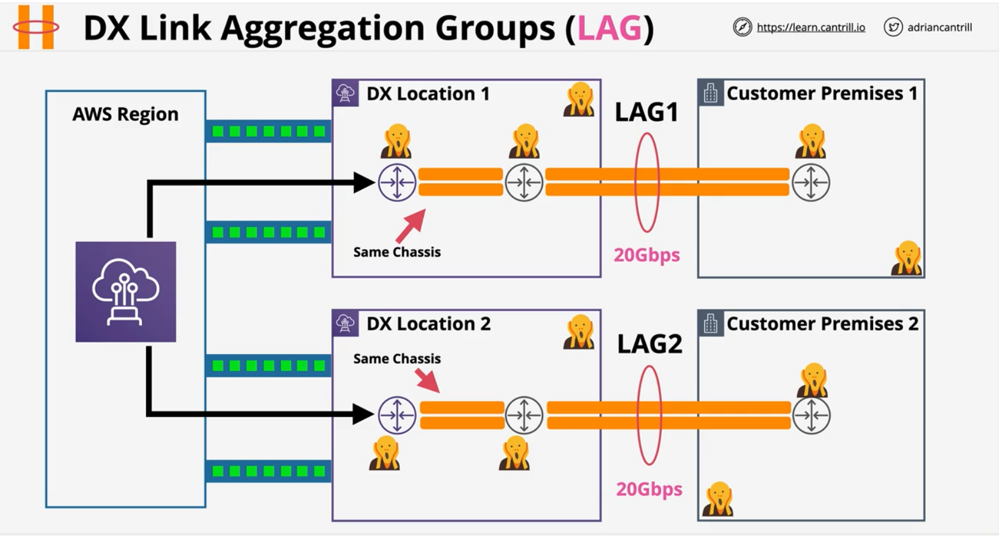

### DX Concepts
- A physical connection **(1, 10 or 100 Gbps)**
- Business Permises => DX Location => AWS Region
- **Port Allocation** at a **DX Location**
    - hourly cost
    - outbound data transfer

- **Provisioning time** - AWS take time to allocate the port
- Once the **port is allocated**, customer will need to arrange connection into the port
    - could take weeks or months to seting up connection intially - like physically laying the cables bettween business permises and DX Location
    - physical cable does not provide resilience

-  **DX** provides **low & consitent latency** + **high speeds**
- Can access AWS **Private** Services (**VPCs**) and AWS **Public** Services - NO INTERNET

- Within the **DX** location, a **Cross Connect** is established between **AWS DX Router** and **Customer DX Router**.
- **AWS DX Rotuer** and **Customer DX Router** resides in **AWS Direct Connect Cage** and **Customer/Comms Cage** respectively.
- Configure Virtual Interfaces over physical cables - VIFs

### DX Physical Connection Architecture
- DX Connection = **Physical Port** (1, 10, 100 Gbps)
- Can only use **Single-mode fibre** and  NO  copper

    | Speed| Transceiver|
    |:---:|:---:|
    |1Gbps| **1000BBASE-LX** (1310 nm) Transceiver|
    |10Gbps| **10GBBASE-LR** (1310 nm) Transceiver|
    |100Gbps| **100GBASE-LR4** |

- Auto-negotiation shoule be DISABLED
    - configure **port speed** and **full-duplex** manually set

- Ensure the **router** in **DX location** supports **BGP** and **BGP MD5** Authentication
    - optional: **MACsec** and Bidirectional Forwarding Detection (BFD)

> VPC endpoints cannot be accesed through Private VIP (don't need them) - accessible through public VIP

### DX Security (MACSec)
MAC Security (MACsec) is an IEEE standard that provides data confidentiality, data integrity, and data origin authenticity.

- Frame **encryption** - **layer 2** - IEE 802.1AE-201188
- **Hop by Hop** encryption between two switches/routers (adjacency)
- **Confidentaility** - strong encryption
- **Data Integrity** - data cannot be modified in transit
- **Data oriign authenticity**
- **Replay Protection** 
- Does not **replace IPSec over DX** - not end-2-end
- Designed to allow for super high spped .. terabit networks 

#### MACSec - 101
- Each MACSec participant creates **secure channel** - unidirectional (1 IN an 1 OUT)
    - Secure Channel Identifier (**SCI**)
- **Secure Associations** - **sessions** on SC, generally **1** exists at a time
    - series of transient sessions
    - **1 exists** at a time except when they are being **replaced**

- MACsec encapsulation - 16 bytes **MACsec tag** & 16 bytes Integrity Check Value (**ICV**)

- MACsec Key Agreement - **discovery, authentication & key generation**
- Cipher Suite - **how** data is **encrypted** .. packets per key, rotation ...

[Get started with MACsec on dedicated connetions](https://docs.aws.amazon.com/directconnect/latest/UserGuide/direct-connect-mac-sec-getting-started.html)

 

### DX Connection process

- A DX connection begins in a **DX location**
    - contains contains **AWS** equipment
    - contains **customer/provider** equipment

- DX location is not owned by **AWS** - renting
    - Cages are rented by AWS and Customers

- Only the DC staff can connect things together.
    - when **authorisation** is provided by all the parties

- **LOA-CFA** - Letter of Authorization and Connecting Facility Assignment 

### DX Virtual Interfaces

#### BGP Session + VLAN
Private and Public VIFs are based on *VLANs* and **BGP sessions**

- DX connections are a layer 2 connection - Data Link
- We need to connect to multiple layers of Layer 3(IP) networks (VPCs & public zone) over the DX connection
- Virtual Interfaces (VIFs) allow us to run multiple L3 networks over the layer 2 direct connect (DX)
- Interfaces - BGP Peering Session + VLAN
    - **VLAN** isolates different layer 3 network
    - **BGP** exchanges **routes & authenticates**

- Types of **VIFS**
    > for hosted connection, there can only 1 VIF
    
    |VIF| Desc| Limit (Dedicated)|
    |:---:|:---:| :---: |
    |**Public VIF**| Use to connect to public zone services which don't run withing VPC|  private+public =50 |
    |**Private VIF**| Use to connect to private services within your VPC| private+public = 50|
    |**Transit VIF**| Allow integration between TGW and DX | 1 |

- **BGP** is between the  **Customer DX router** and **AWS DX router** 
    - can be extended to customer premises

#### Private VIF
- Access **1 VPC*** resources using private IPs (workaround for **multiple VPCs** - **TGW, DXG**)
    - accessing resources like EC2 with public IPs won't work

- Attach to **VGWFs** - 1* VPC only
    - has to be **in the same region** as the DX location your connection terminates in 

- 1 private VIF === 1 VGW ===  1 VPC
- No encryption on private VIFs ..  apps can layer on encyrption (e.g **HTTPS**)
- Can use MTU of **1500** and **9001** (Jumbo Frames) - ensure all the links in the communication chain supports it 
- Using VGW = Route Propagation enabled by default!
    - but will have to terminate the private VIF at the VGW
- VGW has AWS ASN - or you can configure one
- IPv4 or IPv6 (Seperate BGP pereing connetion)
- You configure **YOUR ASN** on the VIF.
    - either public ASN or private ASN (64512 to  65535)
 
**Creating Private VIF**

- Pick the **connection** the VIF will run over
- Choose **VGW** (default) or **Direct Connect Gateway\***
- Interface Owner - **this** AWS account or **another** AWS account
- Choose a **VLAN** id - 802.1Q - needs to match customer config
- Requires **BGP ASN** of on-premises (public or private). If private, use  **64512 to 65535**
    - choose peer IPs or auto-generated by AWS
- AWS will advertise the **VPC CIDR** and the **BGP Peer IPs** (/30's)
    - you can advertise **default**  or **specific corp prefixes** (max 100)
    - beyond 100, the interface will go ideal and won't work
- Once the **VIF is created**, you can download the configuration file and configure the customer equipment
 
 

#### Public VIFs
Public VIFs provide access to AWS public zone services such as SQS, SNS, S3 as well as Public and Elastic IPs

- Access **Public Zone** services
    - .. elastic IPs, public services (e.g SNS, SQS, S3 etc)
- No direct access to private (VPC) services
- Can access all public zone regions - **accross AWS global network**
    - all regions
- AWS advertise all **AWS public IP ranges to you**
    - .. you advertise any **public IPs you own over BGP** - have to work with AWS 

    - .. bi-directional BGP communities - filter what routes you recieve based on geographic region

- Advertised perfixes are not trasitive .. **your prefixes don't leave AWS** ( no other customers)

**Creating Public VIFs**

Easy to set up assuming there is already an operational DX connection

**Public VIF + VPN**

- Neither public or private VIFS offer any form of encryption
- **Encrypted & Authenticated** tunnel
- Running over **DX** (low latency & consistency latency)
- Uses a **Public VIF** + **VGW/TGW** public endpoints - consider what is it you trying to access
- **VPN** is transit agnostice - (**DX/Public Internet**)
- **VPN** is end-2-end encryption (MACsec is single hop based)
    - CGW <====> TGW/VGW

- **VPN** has wider vendor support
- **VPN** has more **CRYPTOGRAPHIC overhead** (limits speeds) vs MACSec
- **VPN** can be used while **DX is being provisioned** and/or as a **DX Backup**

### Direct Connect Gateway
DX Gateway can be used to extend private VIF functionality to allow connections to global VPCs (up to 500) from a single DX connection.
 
- **Global** newtwork device - accessible in  **all regions**
- Associate private VIF to DX Gateway -- Private VIF => DX Gateway( any region)
- Associate with **VGW's** attached to VPCs **globally** in AWS
- Communication between VPCs and On-premises is allowed.
- Communication between VPC with other VPCs via DX Gateway is not allowed
- 1 Private VIF = 1 DX Gateway & **10 VGW** per DX Gateway
    - 1 DX can have **50** private VIFs == **50** DX Gateways == **500** VPCs

**Cross-Account Direct Connect Gateway**

#### DX Gateway, Transit VIFs and TGW
- A DX Gateway can be associated with **VPCs** & **Private VIFs** .. OR .. **TGW** & **Trasnit VIF**  ... NOT BOTH

- **1 Transit VIP/ DX** 
- **1 Transit VIP** can supports **upto 3 TGWs**
- **DXGW** does not route between **attachments** - Use **TGW peering**
- **TGW** can connect to **MAX of 20 DXGW**
- Each **TGW** supports **5000** attachments

 
 

### Direct Connect Resilience
1. Multiple points of failure in default setup of Direct Connect

2. Set up multiple routers in DX location (at least 2 of each AWS router and customer router) - some resiliency
    - point of failure is still DX location and customer premise

3. Multiple (at least 2) DX locations with multiple (at least 2) customer premises - for better resiliency

4. Combine 2 and 3 for the maximum resiliency

### Direct Connect Link Aggregation Groups
- NOT A RESILIENCY FEATURE
- **Multiple** physical connections **act as one** - **speed multiplier**
- Uses **active/active** architecture
    - all members of the LAG are used at the same time
- **2 100Gb ports** or **maximum of 4 connections < 100Gb** per LAG
- All connections need to be the **same speed** and terminate at the **same DX location**
- Attrbute `minimumLinks` determine the **active status of LAG**. if the no. of connections goes below  this number, **the LAG is viewed as failure**.

