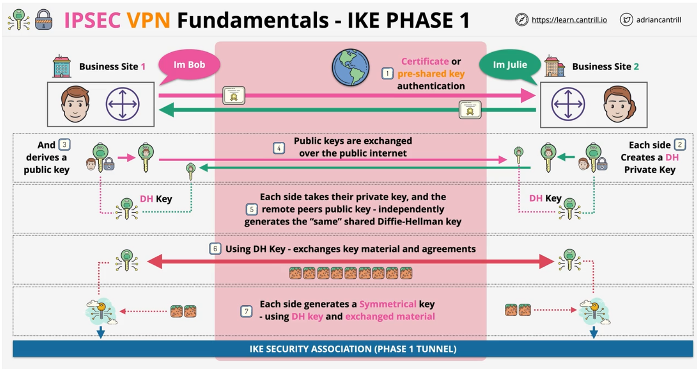
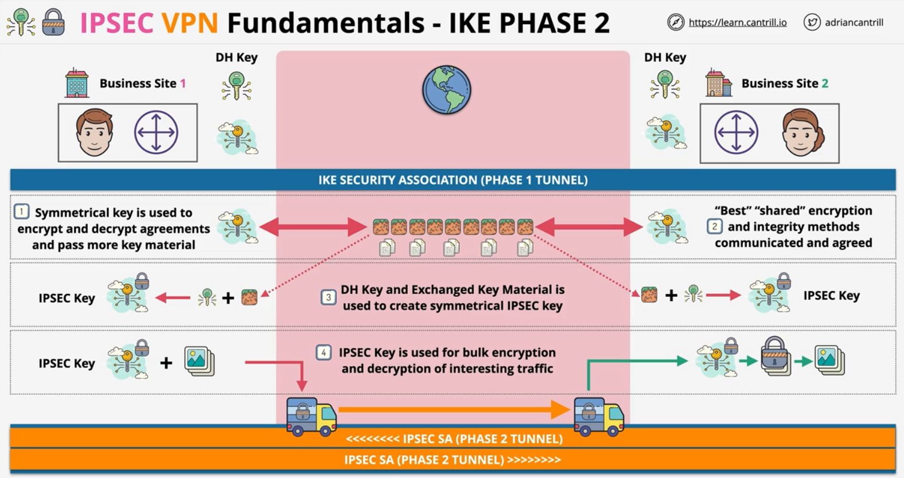

### Fundamentals
>IKE=Internet Key Exchange  
>SA=Securit Association  
>DH=Diffie–Hellman key exchange

- IPSEC is a group of protocols..
- It sets up **secure tunnels** across **insecure networks**
    - between **two peers** (local and remote)
- Data inside tunnels is **encrypted** - **secure** connection over an **insecure** network

- Provieds **Authentication** between peers and data is **encrypted** in transit
- "interesting traffic" is the traffic that is allowed in the encryption domain

####
- **Symmetric Encryption** - **fast** but exchanging **keys** securely is challenging
- **Asymmetric Encryption** - **slow** but exchanging **public keys** is easy

- **IKE Phase 1** - slow & heavy
    - authenticate - pre-shared key(password)/cerficate
    - using asymmetric encryption to agree on and create a shared symmetric key
    - **IKE SA created** (phase 1 tunnel)
- **IKE Phase 2** - fast & agile
    - uses the key agreed in phase 1
    - agree encryption method, and keys used for bulk data transfer
    - **Create IPSEC SA** .. phase2 tunnel (architecturally running over phase1)
- **Policy-based VPNs**
    - ..rule sets match traffic => a pair of SAs
    - ..different rules/security settings
- **Route-based VPNs**
    - ..target matching (prefix)
    - ..matches a single pair of SAs

###

