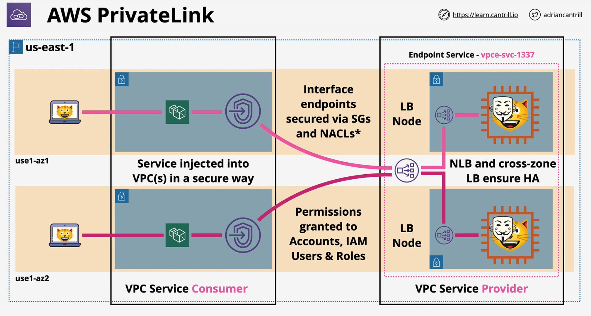

AWS PrivateLink provides private connectivity between VPCs, AWS services, and on-premises applications, securely on the Amazon network.

### Key Points

- **HA** via **multiple endpoints in multiple AZ**
- Only supports IPv4 and TCP(IPv6 is not supported)
- **Private DNS is supported** (verified domains)
- **Direct Connect, Site-to-Site VPN** and **VPC Peering are supported**. 

