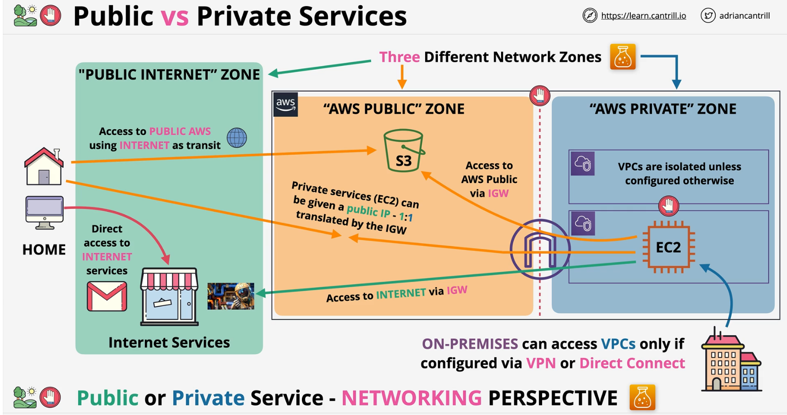

#### Diffferentiors
- **NETWORKING** PERSPECTIVE but there is also PERMISSION prespective for authorization

| Public Internet| AWS Public Zone| AWS private Zone|
|:---:|:---:|:---:|
|Internet services like email|AWS Public servcies like s3| Resources located inside private VPCs like EC2 instances|

