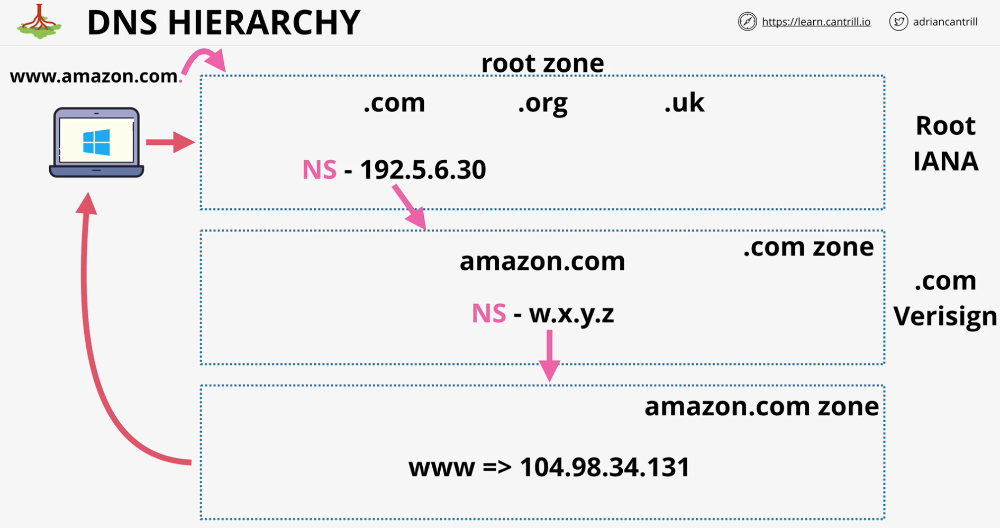
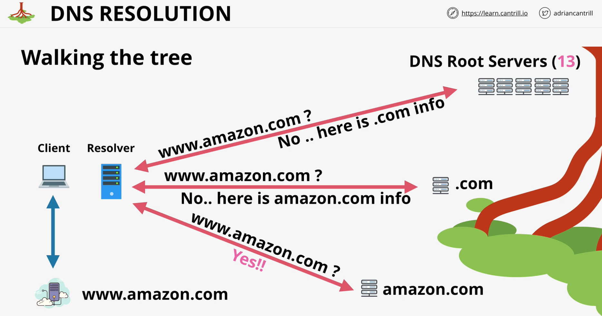

Domain Name System - distributed discovery service

- Information is distributed and delegated - recursive query

|DNS Client| Resolver |Zone | Zonefile| Nameserver|
|:--:|:--:|:--:|:--:|:--:|
|laptop, phone| software on you device or a server which queries DNS on your behalf| A part of the DNS database| physical database for a zone| where zonefiles are hosted|

- **Root Hints** => provided by OS vendor - config points at the root server IPs and addresses
- **Root Server** => hosts the DNS root zone
- **Root Zone** => points at TLD authoritative servers
- **gTLD** => generic top level domain (.com .org)
- **ccTLD** => country-code top level domain (.uk, .eu etc)

  

IANA : https://www.iana.org

Root hints : https://www.internic.net/domain/named.root

Root Servers : https://www.iana.org/domains/root/servers

Root Zone Database : https://www.iana.org/domains/root/db

Root Zone File : https://www.internic.net/domain/root.zone

Delegation Record for .com : https://www.iana.org/domains/root/db/com.html